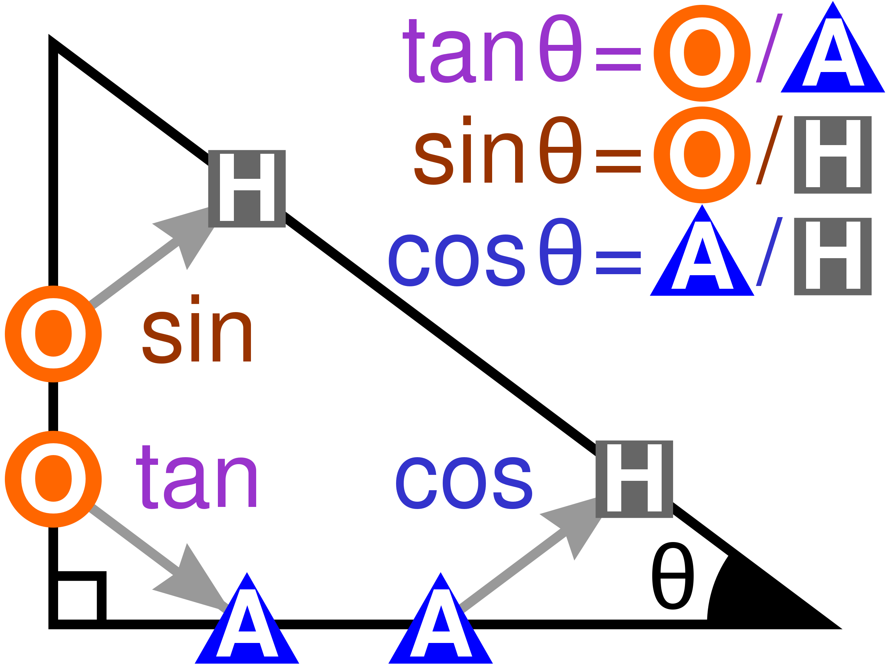

# 3D Math Trigonometry

The `arc-` prefix indicates inverse, so `arctan` is inverse tanget.

## Calculating Right-Angled Triangle Degrees

$$
\sin \theta ={\frac {\mathrm{opposite} }{\mathrm {hypotenuse} }}
$$

$$
\cos \theta ={\frac {\mathrm{adjacent} }{\mathrm {hypotenuse} }}
$$

$$
\csc \theta ={\frac {\mathrm{hypotenuse} }{\mathrm {opposite} }}
$$

$$
\sec \theta ={\frac {\mathrm{hypotenuse} }{\mathrm {adjacent} }}
$$

$$
\tan \theta ={\frac {\mathrm{opposite} }{\mathrm {adjacent} }}
$$

$$
\cot \theta ={\frac {\mathrm{adjacent} }{\mathrm {opposite} }}
$$

## Mnemonics

`SOH-CAH-TOA`:

- **S**ine = **O**pposite ÷ **H**ypotenuse
- **C**osine = **A**djacent ÷ **H**ypotenuse
- **T**angent = **O**pposite ÷ **A**djacent

## Example

$$
\sin A = {\frac a c}
$$

$$
\cos A = {\frac b c}
$$

$$
\tan A = {\frac a b}
$$