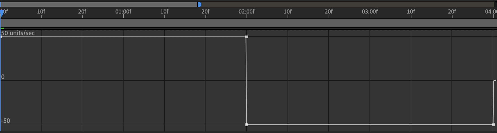
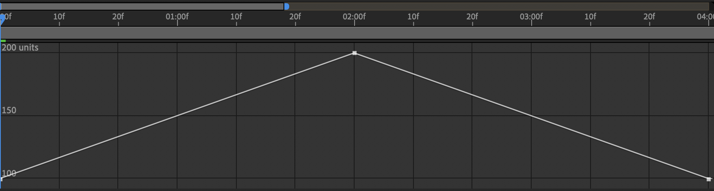
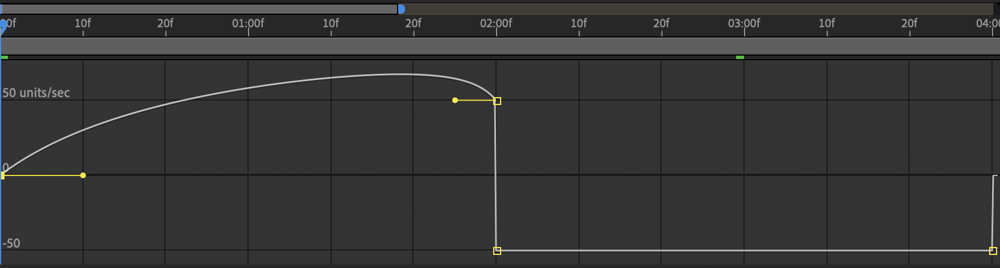
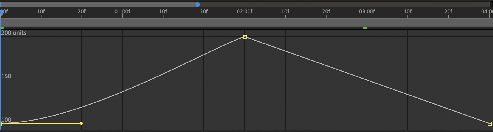
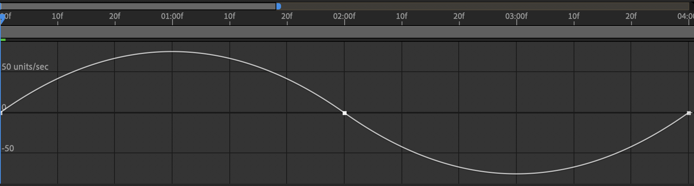
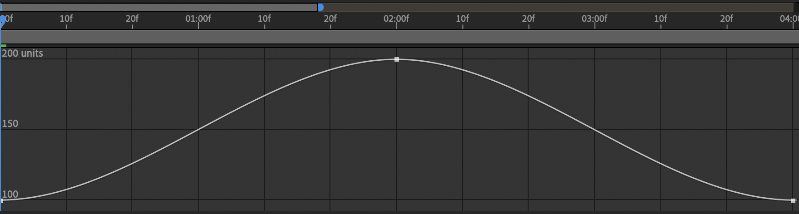
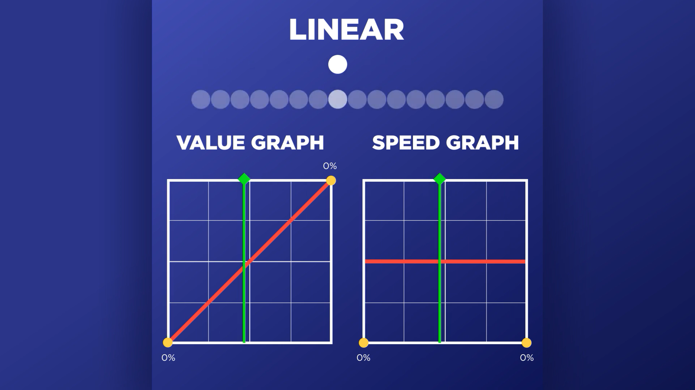
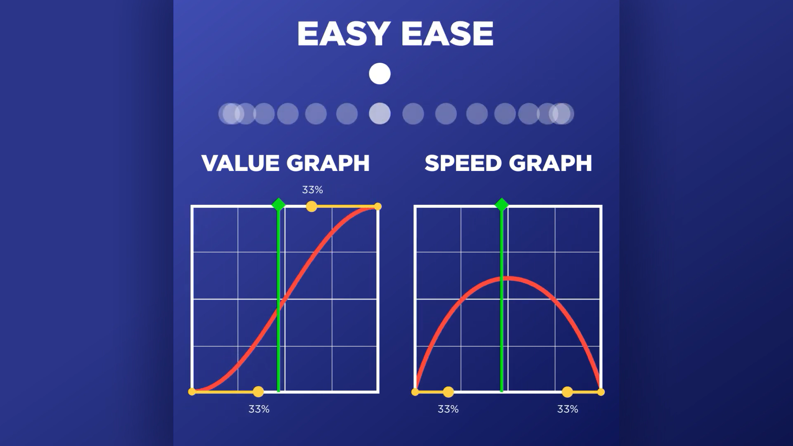
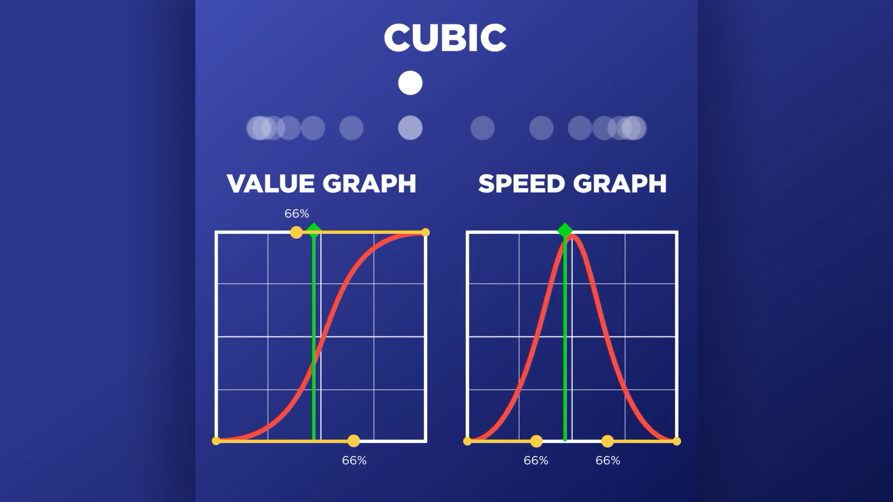
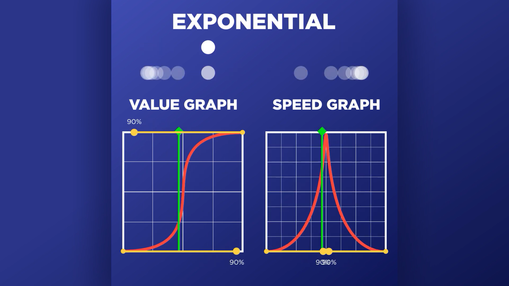

# After Effects Graph Editor

- `⇧F3`: Toggle `Graph Editor`
- `F9`: Apply easy ease to keyframes
- `⌘`-click keyframe: Switch keyframe back to linear
- `-`: Zoom out
- `=`: Zoom in

## Tips

- To select all points in the Graph Editor, simply click the property name.
- To clear graph editor changes, select the keyframes then enter the graph editor (`⇧F3`) and click the `Convert selected keyframes to Linear` button at the bottom.
- You can select multiple properties (by `⇧`-clicking) and see their graphs in the Graph Editor simultaneously.
- You can adjust a bunch of points at once by selecting them and then dragging the Bézier handles, all the points will be adjust simultaneously.
- It's easy to just cut a point and paste it where the playhead is.
- Click the `Fit all graphs to view` button below the `Graph Editor` to fit the graph to the view.
- There are preset buttons for Easy Ease, Easy Ease In, and Easy Ease Out below the Graph Editor.

## 3 Keyframes Easy Ease

Using three keyframes.

### Linear

#### Speed

#### Value

### One Keyframe Easy Ease

#### Speed

#### Value

### All Three Easy Ease

#### Speed

#### Value

## Dimensions

- Hover the cursor over a graph line to see what that line corresponds to (e.g., a position graph will have "X" and "Y" values).
- To get separate graphs for each axis, right-click a property and select "Separate Dimensions".

## Graph Types

There are two ways to view the graph: the "Value Graph" and the "Speed Graph". These are the same data displayed differently, so changing one also changes the other. The amount you adjust the handles is called "influence". 

The options icon (below the Graph Editor, it looks like a bulleted list) is where you switch between the value graph and speed graph.

### Speed

The speed graph works a bit differently, the handle can't be rotated, so there's only two values:

1. **Speed**: The height of the point.
2. **Influence**: The length of the handle.

#### Keyframe Velocity

Speed and influence can also be set via a dialog box by choosing `Animation > Keyframe Velocity...` (`⇧⌘K`). This can also be used to change the speed graphs for several properties simultaneously.

The keyframe velocity is the same data and format as the speed graph, so changing the keyframe velocity also changes the speed graph (and the value graph).

A good a way to duplicate graph data across properties is to draw it visually in the graph editor, and then copy the values from `Keyframe Velocity` to the other properties.

## Curves

### Presets

With some keyframes selected, you can choose an Easy Ease preset by choosing an option under "Animation > Keyframe Assistant".

### Examples

[Source](https://www.schoolofmotion.com/blog/graph-editor-after-effects/)