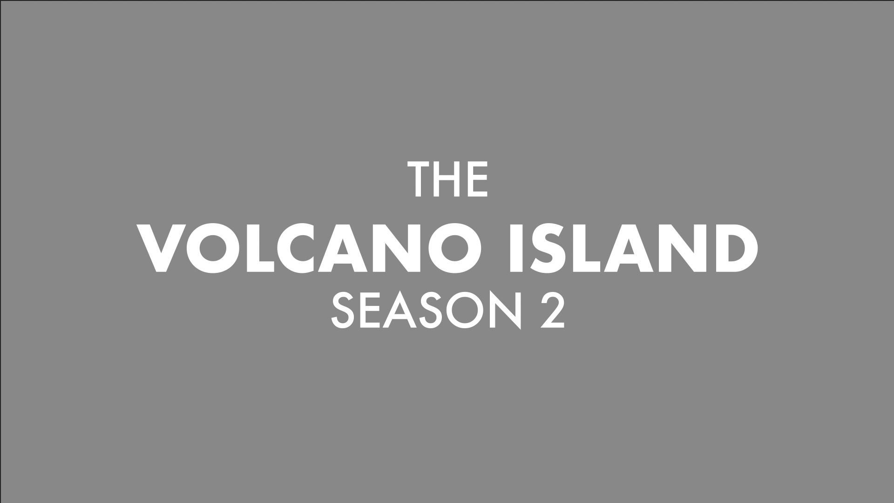
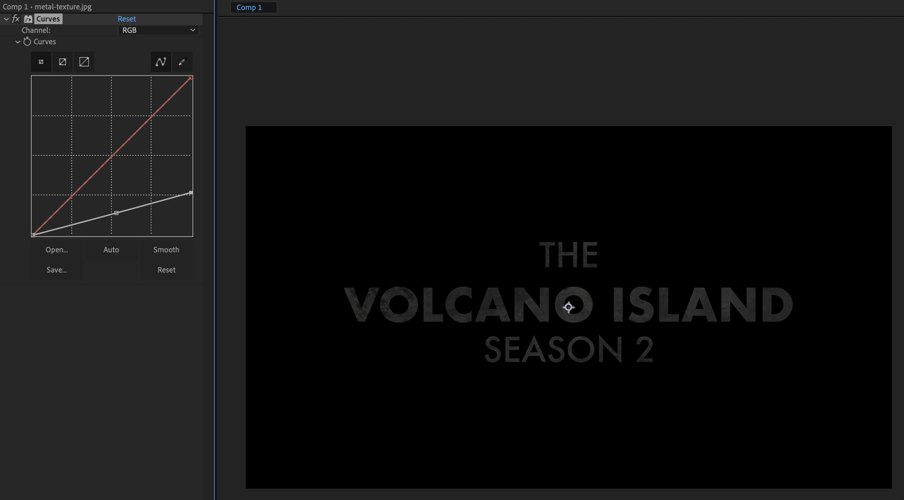
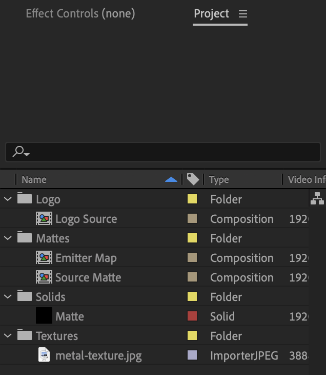
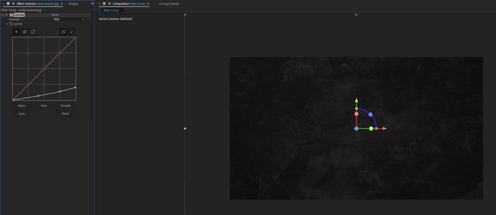
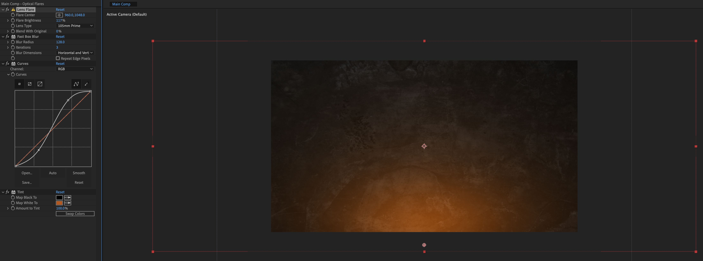

# After Effects Trapcode Particular Flame Text

1. Make a new composition, `1920x1080`, `7` seconds long, `24` frames per second, called `Logo Source`, with a black background color, and call it `Logo Source`
2. Add the text:

        THE
        VOLCANO ISLAND
        SEASON 2

    Use `Futura`, with `THE` and `SEASON 2` medium and `VOLCANO ISLAND` bold, center it in the composition and make it white.

    
3. Drag a metal texture into the layers panel below the text layer
4. In the layers panel, for the metal texture, change the `TrkMat` layer to `Alpha Matte "THE VOLCANO ISLAND SEASON 2"` (this cuts the layer out based on the alpha of the layer above it)
5. Add a `Color Correction > Curves` effect to the metal texture layer, and use it to darken and add contrast.

    

6. Click the `Toggle Transparency Grid` icon to disable the background.

## Matte

1. Create a new composition with the same settings as above and call it `Source Matte`
2. Create a new black solid and call it `Matte`
3. Add a `Noise & Grain > Fractal Noise` effect to the solid
4. Under `Matte > Effect Controls > Fractal Noise`, set `Contrast: 250`
5. `⌥`-click the `Evolution` stopwatch to add an expression and enter `time * 25`
6. Go to `1:12f` and add a keyframe for `Matte > Effects > Fractal Noise > Brightness` and set it to `-150.0` (all black)
7. Go to `4:00f` and set `Matte > Effects > Fractal Noise > Brightness: 150.0` (all white) *We now animate from black to white, we'll be using the white to cut out our text and emit particles*

### Emitter Map

1. Create a new composition and call it `Emitter Map`

## Re-Organize

1. Re-organize the `Project` panel, so that mattes are in a `Mattes` folder, and `Logo Source` is a `Logo` folder:

    

2. Drag the `Source Matte` and `Logo Source` into the `Emitter Map` composition (`Source Matte` on top and `Logo Source` on the bottom)
3. With the `Emitter Map` composition selected, for `Logo Source` set the `TrkMat` to `Luma Matte "Source Matte"` (this reveals the `Logo Source` based on the white values of the `Source Matte`)
4. The `Source Matte` is going to be used to emit particles and we want to stop emitting once the text is fully revealed. Go to `3:12` and add a keyframe for `Source Matte > Transform > Opacity: 100%`, then move to `3:13` and add a keyframe for `Source Matte > Transform > Opacity: 0%`.

## Second Matte

1. Make a new composition, `1920x1080`, `7` seconds long, `24` frames per second, called `Logo Source`, with a black background color, and call it `Text Reveal`
2. Move the composition under `Mattes` if it's not there already
3. Drag the `Logo Source` into the `Text Reveal` composition
4. Drag the `Source Matte` into the `Text Reveal` composition, above `Logo Source`
5. Under `TrkMat` for `Logo Source`, choose `Luma Inverted Matte "Source Matte"` *We now have two versions of the logo with mattes setup, one where the text is removed in the white areas, and one where it's added in the white areas, they're the inverse of each other*

## Heat Map

1. Create a new composition and call it `Heat Map`
2. In `Heat Map`, create a new black solid and call it `Particular`
3. Add `Particular` to the layer
4. Make a new all black solid background called `BG` and move it behind the `Particular` layer

### Particular

1. Under `Effect Controls > Particular`, set:
    - Under `Emitter`:
        - `Particles/sec: 50`
        - `Emitter Type: Box`
        - `Emitter Size: XYZ Individual`
        - `Emitter Size X: 2320`
        - `Position XY: 960, 1241` (below the view port)
    - Under `Particle`:
        - `Size: 50`
        - `Color: Red`
        - `Size Random: 26%`
        - `Size: 150`
    - Under `Environment`:
        - `Gravity: -250`

## Main Comp

1. Make a new composition and call it `Main Comp`
2. Drag in the metal texture as a background, and scale it up a bit (e.g., `162%`)
3. In the layers panel, toggle on the 3D icon for the metal texture
4. Hit `p` to reveal the layer `Position` property, and increment the `Z` value until the metal texture no longer fills the frame (i.e., zoom it out)
5. Hit `s` to reveal the layer `Scale` property, and scale up the texture until it fills the frame again
6. Add a `Curves` effect to the metal texture layer
7. Adjust the `Curves` graph to decrease brightness and increase contrast:

    

## Lens Flare (Optional)

1. Create a new black solid layer called `Optical Flares` in `Main Comp` above the metal texture
2. To `Optical Flares`, add the following effects:
    - `Generate > Lens Flare`
    - `Blur & Sharpen > Fast Box Blur`
    - `Color Correction > Curves`
    - `Color Correction > Tint`
3. In the Layers panel, change the `Mode` of the `Optical Flares` layer to `Add`
4. Move the center of the lens flare to the bottom middle of the project, this is just to create an ambient light
5. Adjust the `Lens Flare > Flare Brightness`, `Fast Box Blur > Blur Radius`, `Curves`, and `Tint` settings, and scaling up the layer to match the screenshot

    

6. `⌥`-click the stopwatch for `Lens Flare > Fast Box Blur > Iterations` and set a `wiggle(5, 2)` expression to give some flickering to the flare.

## Disintegration Effect

1. Drag the `Emitter Map` layer from the `Project` panel into the `Main Comp`, make it the bottom layer and toggle off its visibility, and toggle on 3D layer
2. Drag the `Text Reveal` layer into the `Main Comp` and make it the top layer, and toggle on 3D layer
3. Drag the `Heat Map` layer into the `Main Comp` and make it the bottom layer, and toggle off its visibility
4. Make a new black solid layer called `Sparks (Main)` and make it the top layer
5. Add a `Particular` effect to `Sparks (Main)`
6. Under `Sparks (Main) > Effect Controls > Particular > Emitter`, set `Emitter Type: Layer`, `Layer Emitter > Layer: Emitter Map` (note that the emitter layer must be a 3D layer), `Layer Emitter > Layer Sampling: Particle Birth Time`, and `Layer Emitter > Layer RGB User: None`
7. Under `Sparks (Main) > Effect Controls > Particular`, under `Emitter`, set `Particles/sec: 50000`, `Velocity: 7`, under `Particle`, set `Life (seconds): 1`, `Color` to an orange, sparky color, `Opacity Random: 25`, `Size Random: 40`, `Blend Mode: Add`
8. Set the blend mode of `Sparks (Main)` to `Add`
9. Under `Sparks (Main) > Effect Controls > Particular > Environment`, set `Gravity: -100`, `Wind X: 250`, `Wind Y: -95`, `Wind Z: -50`
10. Set `Sparks (Main) > Effect Controls > Particular > Particle > Size: 1.5`
11. In the layers panel, turn on `Motion Blur` for `Sparks (Main)`

## Glow

1. Add a `Glow` effect to `Sparks (Main)`, and set its `Glow Threshold: 65` and `Glow Intensity: 2`
2. Add a second `Glow` effect to `Sparks (Main)`, and set its `Glow Threshold: 66`, `Glow Radius: 4`, and `Glow Intensity: 1`

## Fixing Emitter Map

1. The text disappears at around `03;08`, but the text in the `Emitter Map` composition disappears at `03;12`. So in the `Emitter Map` composition, move the starting and ending `Source Matte > Transform > Opacity` keyframes to end at `03;08`.

## Turbulence

E.g., twirling in the particles.

1. Under `Sparks (Main) > Particular > Displace > Turbulence Field`, set `TF Displace XYZ: 100 `

## Duplicate

1. Duplicate the `Sparks (Main)` layer and call the duplicate `Sparks (Small)`
