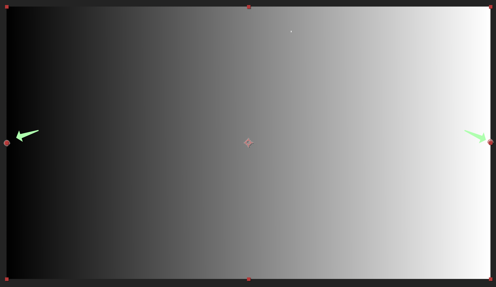
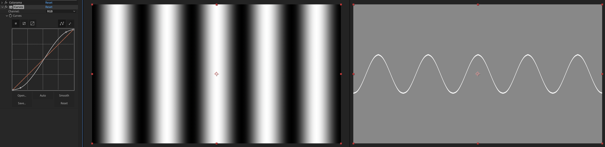
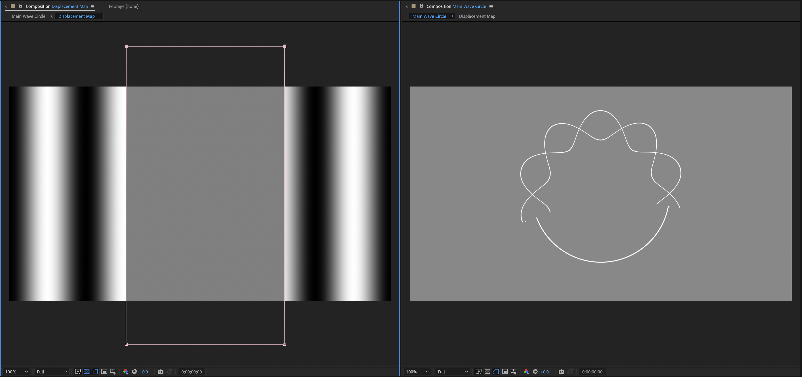

# After Effects Displaced Wave

## Setup

1. Create a new `1920x1080` composition, `6` seconds long, with a black background
2. Add a black solid and call it `Circle`
3. Apply a `Beam` effect to `Circle`
4. Under `Effect Controls > Beam`, set `Staring Point: 0.0, 540.0`, `Ending Point: 1920.0, 540.0`, `Length: 100`, `Inside Color: White`, and `Outside Color: White`.
5. Hit `⌘K` to bring up the composition settings and rename the composition to `Main Wave Circle`

## Displacement Map

1. Create a new composition (`⌘N`) and call it `Displacement Map`
2. Select `Main Wave Circle > Circle`, and add a `Displacement Map` effect to it
3. Go to the `Displacement Map` composition, and create a black solid (`⌘Y`)
4. Apply a `Gradient Ramp` effect to the solid
5. Move the points on the gradient map so the gradient goes from black to white horizontally

    

6. From the `Project` panel, drag the `Displacement Wave` layer below the `Circle` layer in the `Main Wave Circle` layer
7. Set `Circle > Effect Controls > Displacement Map > Displacement Layer: 2. Displacement Map`
8. Toggle off the visibility of the `Displacement Map` layer
9. Under `Circle > Effect Controls > Displacement Map`, set `Use For Horizontal Displacement: Off`, `Max Horizontal Displacement: 0.0`, `Use For Horizontal Displacement: Luminance`, and `Max Vertical Displacement: 150.0`
10. Under `Displacement Map > Black Solid 1 > Effect Controls`, clean up the ramp start and end, by setting `Start of Ramp: 0.0, 540.0` and `End of Ramp: 1920.0, 540.0`
11. Add a `Colorama` effect to `Displacement Map > Black Solid 1`
12. Set `Colorama > Output Cycle > Use Preset Palette: Solarize Grey`. This has black on both sides, which we need to do to make sure we have a seamless loop.
13. Set `Colorama > Output Cycle > Cycle Repetitions: 5`
14. Go back to the `Main Wave Circle` composition, the line should now look jagged (like a sawtooth wave), the wave looks pixelated because the bit depth is too low, fix this by `⌥`-clicking the `8 bpc` below the list of compositions in the project panel.

## Tweaks

1. Make a second viewer (`View > New Viewer` / `⇧⌥⌘N`), set the first viewer to the `Displacement Map`, and the second viewer to `Main Wave Circle`, so we're viewing the two compositions side-by-side
2. Add a `Color Correction > Curves` effect to the `Displacement Map > Black Solid 1`
3. Adjust the very top and bottom of the curve slightly to make a slight S shape

    

4. To distort the line into a circle, add a `Distort > Polar Coordinates` to `Main Wave Circle > Circle`, set `Type of Conversion: Rect to Polar` and `Interpolation: 100%`.
5. Rename `Cirle` to `Circle 1` and duplicate it (`⌘D`, the second circle should be called `Circle 2`)
6. Set `Circle 2 > Effect Controls > Displacement Map > Max Vertical Displacement: -150`

## Neutralize Part of the Displacement Map

Use gray to neutralize part of the displacement map to create some variation.

1. Go to the `Displacement Map` composition, and create a new solid (`⌘Y`) and set the color as `H: 0 S: 0 B: 50` to make it gray
2. Select the `Rectangle Tool` and draw over the solid layer to create a mask, and center the mask

    

3. Toggle off the `Constrain Proportions` for the `Displacement Map > Gray Solid 1 > Mask 1 > Mask Feather`, and set it to `150.0, 0.0`
4. Set `Circle 1 > Effects > Displacement Map > Gray Solid 1 > Mask 1 > Mask Feather: 80.0, 0.0` and `Circle 2 > Effects > Displacement Map > Gray Solid 1 > Mask 1 > Mask Feather: -80.0, 0.0`
5. Close the second viewer by clicking the `X` icon

## Offset

1. Create a new `#888888` solid (`⌘Y`) and name it `Offset`, and toggle on `Adjustment Layer` in the layers panel
2. Rename `Black Solid 1` to `Gradient`
3. Add an `Effect > Distort > Offset` to `Offset`
4. Add a keyframe at `0` for `Displacement Map > Offset > Shift Center To`
5. Move the playhead to the end (for the `6s` composition, this will be `5;29`), and add another keyframe for `Displacement Map > Offset > Shift Center To`
6. Double-click the second keyframe, and set it to `% of composition` and `X: 150%`, this will make the offset move a full circle to create a seamless loop
7. Add a keyframe to `Gradient > Effect Controls > Colorama > Phase Shift` at the beginning and end of the composition, at the end of the composition, set it to `-3x0.0` (`3` is so it moves a bit faster than the offset)
8. Take the two `Displacement Map` keyframes, for `Colorama > Phase Shift` and `Offset > Shift Center To` to the one frame beyond the last frame (this is so the first and last frames aren't duplicates of each other):

    

## Playback

1. Try playing the `Main Wave Circle` composition to see the displaced wave effect.

## Background

1. Add a gray solid and move it to the farthest back layer as the background

## Adding More Types of Distortion

### Fractal Noise

1. Create separate side-by-side views, with the `Main Wave Circle` on the left, and the `Displacement Map` on the right. Lock both views by clicking the lock icon in their tab.
2. Create a gray solid on `Displacement Map`, and add a `Noise > Fractal Noise` effect, move the new solid layer (`Gray Solid 3`) below `Offset`
