# Blend Modes

## Terminology

Both of these techniques are applied to a negative-to-positive process, so darkening is actually lightening and vice-versa.

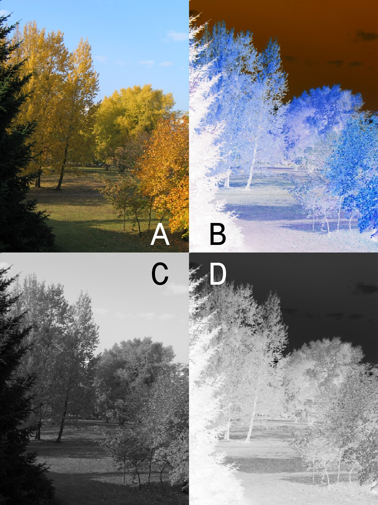

**Burning**: Giving extra exposure to part of a negative to darken it, resulting in it being lighter in the positive.

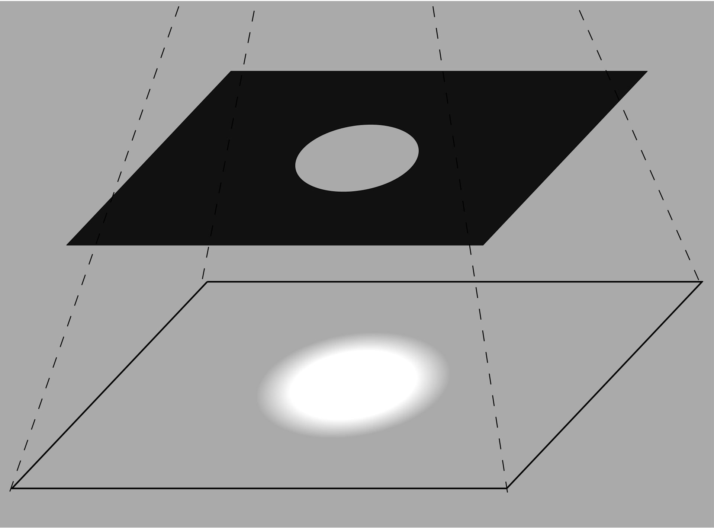

**Dodging**: Blocking certain parts of a negative and lightning the rest, resulting in it being darker than the positive.

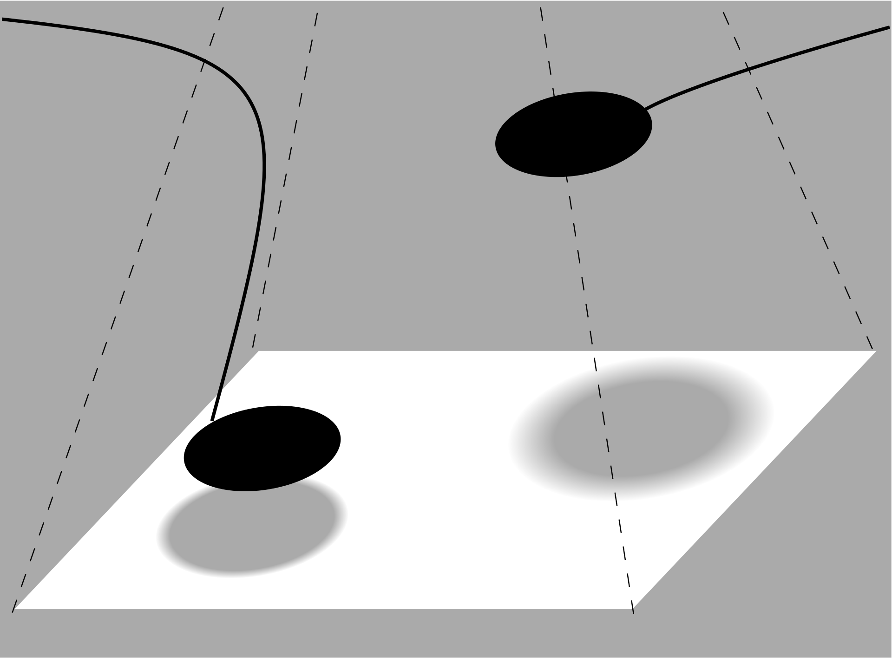

## Normal

Makes each pixel is the result color.

## Dissolve

Like normal, but color choices are based on randomization and opacity.

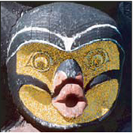

## Darken

Choose the darker of the base and blend color.

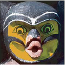

## Multiply

Multiply the base color by the blend color, the result is always darker.

## Color Burn

Darken the base color by increasing the contrast with the blend color.

The inverse of color dodge.

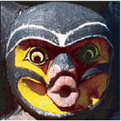

## Linear Burn

Darken the the base color by decreasing the brightness.

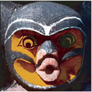

## Lighten

Choose the lighter of the base color and blend color.

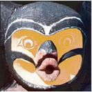

## Screen

Multiply the inverse of the blend and base colors, the result is always lighter.

## Color Dodge

Brighten the base color by decreasing the contrast with the blend color.

The inverse of color burn.

## Linear Dodge

Brighten the base color by increasing the brightness.

The inverse of linear burn.

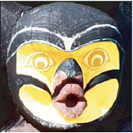

## Overlay

Use screen on light base colors, and multiply on dark base colors.

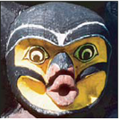

## Soft Light

Use dodge on bright base colors, and burn on dark base colors.

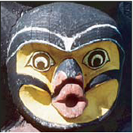

## Hard Light

Use screen with bright blend colors, and multiply with dark blend colors.

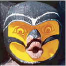

## Vivid Light

Use dodge with bright blend colors, and burn with dark blend colors.

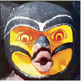

## Linear Light

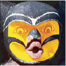

## Pin Light

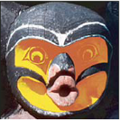

## Hard Mix

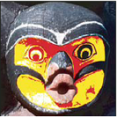

## Difference

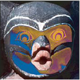

## Exclusion

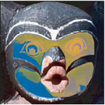

## Subtract

## Divide

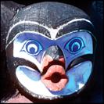

## Hue

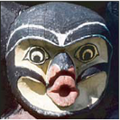

## Saturation

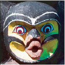

## Color

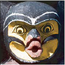

## Luminosity

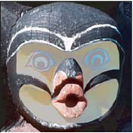

## Lighter Color

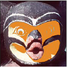

## Darker Color

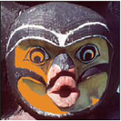

* * *

## Screen

- **Screen**: Like multiply, but lightens.
- **Overlay**: A combination of multiply and screen, it darkens darker areas and lightens lighter areas. It increases contrast.
- **Lighten**: Take the lightest color.

Those are the major types of blend modes, normally there are other variations of those grouped together (e.g., in Photoshop).

## More

- **Normal**: No blending, just overlay.
- **Add**: Similar to lighten, but lighten takes the higher of the two values.
- **Screen**: Another lighten effect.
