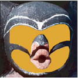

# Blend Modes

## Normal

## Dissolve
## Darken
## Multiply

Multiplies the top layer's RGB channel values with the bottom layer.

## Color Burn

## Linear Burn

## Lighten

## Screen

## Color Dodge

## Linear Dodge

## Overlay

## Soft Light

## Hard Light

## Vivid Light

## Linear Light

## Pin Light

## Hard Mix

## Difference

## Exclusion

## Subtract

## Divide

## Hue

## Saturation

## Color

## Luminosity

## Lighter Color

## Darker Color

* * *

## Screen

- **Screen**: Like multiply, but lightens.
- **Overlay**: A combination of multiply and screen, it darkens darker areas and lightens lighter areas. It increases contrast.
- **Lighten**: Take the lightest color.

Those are the major types of blend modes, normally there are other variations of those grouped together (e.g., in Photoshop).

## More

- **Normal**: No blending, just overlay.
- **Add**: Similar to lighten, but lighten takes the higher of the two values.
- **Screen**: Another lighten effect.
