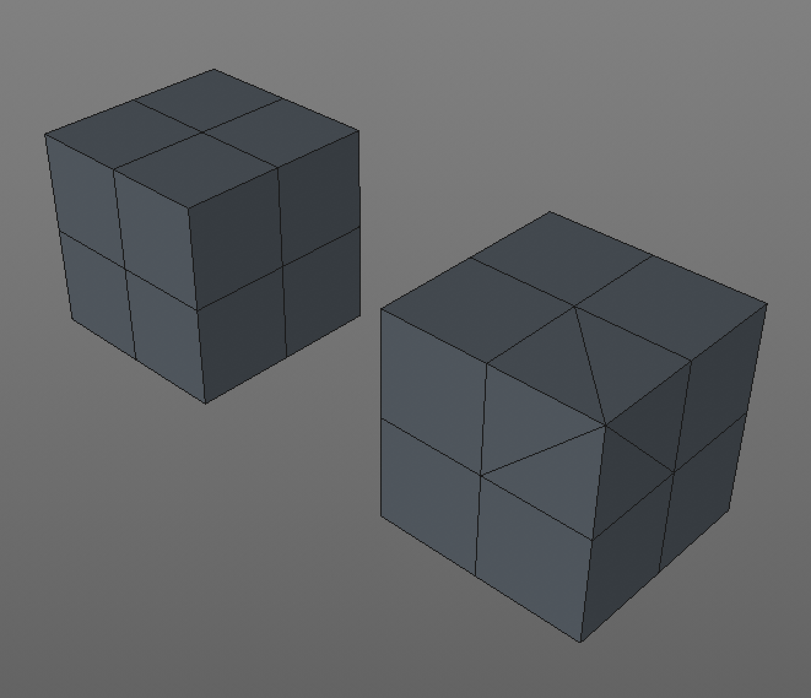

# Blender Modeling

## Operations

- `⇧␣`: Operation menu

### Switching Operations

When the mode menu is visible, use these shortcuts to change modes.

- `␣`: Cursor

The following can also just be hit directly to immediately start doing the corresponding action:

- `g`: Move ("grab")
- `r`: Rotate
- `s`: Scale
- `b`: Select

## Meshes

### Sphere

The difference between sphere types is how they're modeled.

- **UV Sphere**: UV mapping is the process of projecting a 2D image onto a 3D model for texture mapping. The letters "U" and "V" represent axes in 2D space because "X", "Y", and "Z" are already used as the axes of a 3D object. UV spheres use vertical lines similar to longitude and latitude lines, and use quads. UV spheres are best for smooth, symmetrical, shapes with a lot of subdivisions. Faces in a UV sphere do not all have the same area, which could cause problems when mapping organic textures. UV spheres are symmetrical.

- **Ico Sphere**: An icosahedron is a polyhedron with 20 faces, the name comes from the Ancient Greek *eíkosi*, meaning "twenty". An ico sphere is modeled like a polyhedron. Ico spheres are better for rough surfaces. Ico sphers are asymmetrical. All faces have the same area, which may be better for mapping geometric textures because stretching will be minimized.

Illustrating how each sphere is modeled at various polygon counts. Note that the UV sphere on the left looks smoother and the ico sphere on the right looks rough.

After applying a displacement modifier, the ico sphere on the left looks more organic, while the UV sphere on the right looks pixelated.

### Polygons

- **Quads**: Quads are slower, but handle many subdivisions more gracefully. So they're better when trying to represent smooth, curved, surfaces.
- **Triangles**: Triangles are faster, but don't handle subdivisions as gracefully.

In this example, one cube has a single corner represented by triangles.

When that cube is subdivided, in order to create smooth rounded corners, the resulting corner is messy and causes artifacts in the reflection. 

### Tips

- Once one of the above actions is attached, tapping the corresponding axis letter, e.g., `z`, `x`, or `y` will lock the movement into that axis.
- To transform by a factor, hit the transform key then a number, e.g., `s10↩` will scale up `10x`
- `↩` accepts the operation
- Right-click or `ESC` cancels any of the above actions.

### Middle Mouse Button

A middle mouse button tap can be used to lock the manipulation into a particular action. The sequence looks like:

1. Tap a manipulation shortcut, e.g., `g` to move
2. Move the mouse slightly in the correct axis
3. Hold `⌥` and tap to lock it into that axis

With "Edit" > "Preferences" > "Input" > "Emulate 3 Button Mouse" enabled, hold `⌥` to emulate a three button mouse.
