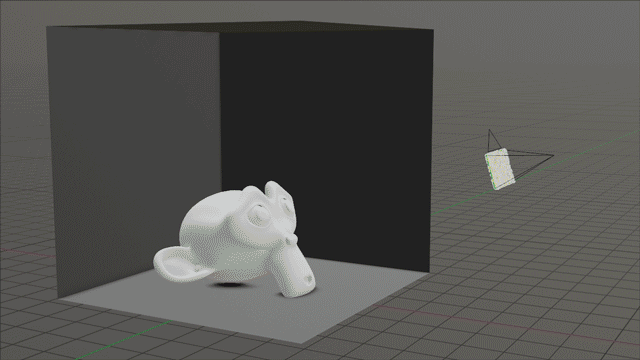

# Blender Rendering

## Rendering

1. Go to "Render" > "Render Image" (`F12`).
2. Type `S` to save the image

## Rendering Engines

The rendering engine is set under "Render Properties".

- **Eevee**: A real-time rendering engine. A biased rendering engine Really fast renders for working on long animations. It's comparable to a game rendering engine like Unreal Engine. It uses rasterization in OpenGL.
- **Cycles**: An unbiased, ray-traced, rendering engine. Animated movies like Toy Story use unbiased, ray-tracing, rendering engines. It uses path tracing.

### Terminology

#### Path Tracing

Path tracing applies the Monte Carlo Method of using random samples to rendering by simulating rays of light hitting an object. Path tracing naturally simulates many effects that need to be separately added to other rendering methods, like ambient occlusion, caustics, depth of field, indirect lighting, motion blur, and soft shadows. While it doesn't perfectly render light because it uses averaging, but does result in the most accurate images in computer graphics. It's also slow.

#### Rasterization

Rasterization works by projecting the faces of a model onto the pixels that make up a 2D image. Rasterization isn't as accurate because it works with pixel information rather than simulating light. Rasterization is fast.

## Notes

- To remove specific objects from the render, click the "Filter" icon in the upper-right object hierarchy, and toggle on "Disable in Renders". This will add an additional camera icon to the tree view that toggles whether the object will appear in the render.
- To make a layer transparent, toggle on `Render Properties > Film > Transparent`.