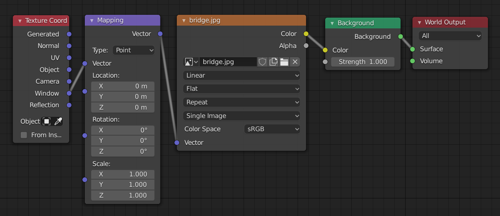

# Blender Background Image

## Eevee

### Method 1

1. Under `World Properties` turn on `Use Nodes`
2. Click the circle to the right of `Color: Environment Texture`. Click `Open` (the folder next to `Color`).

### Method 2

1. Go to the `Shading` tab, and switch to `World` in the bottom pane.
2. Add an `Image Texture` and connect the `color` output to the `color` input of the existin `Background` node (you may have to zoom out to find this node).
3. Add a `Mapping` node and attach the `vector` output to the `vector` input of the `Image Texture`.
4. Click the `Open` folder on the `Image Texture` and select the image.
5. Add a `Texture Coordinator` and attach the `Window` output to the `Vector` input of the `Mapping`.

#### Dimension

1. Select `Output Properties` and set `Dimensions > Resolution` to the size of the image.

## Cycles

Under "World Properties" select "Surface: `Background`" (this is the default), and "Color: `Environment Texture`", then click the folder to choose your file.
