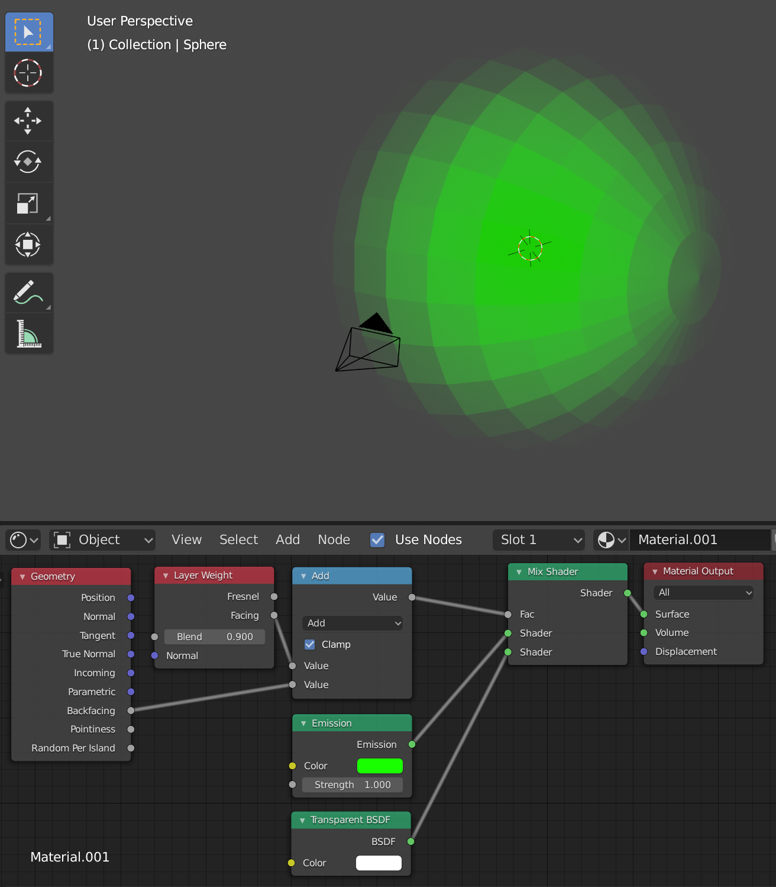

# Blender Blur Edges

1. Add a `Geometry`.
2. Add a `Layer Weight`, and set `Blend: 0.9`.
3. Add a `Math` and toggle on `Clamp`.
4. Add a `Mix Shader`.
5. Add a `Transparent BSDF`.
6. Connect the `Geometry > Backfacing` output to the bottom `Add > Value` input.
7. Connect the `Layer Weight > Facing` output to the top `Add > Value` input.
8. Connect the `Add > Value` output to the `Mix Shader > Fac` input.
9. Connect the output of the `Transparent BSDF` to the bottom `Mix Shader > Shader` input.
10. Connect the existing shader to the top `Mix Shader > Shader` input.