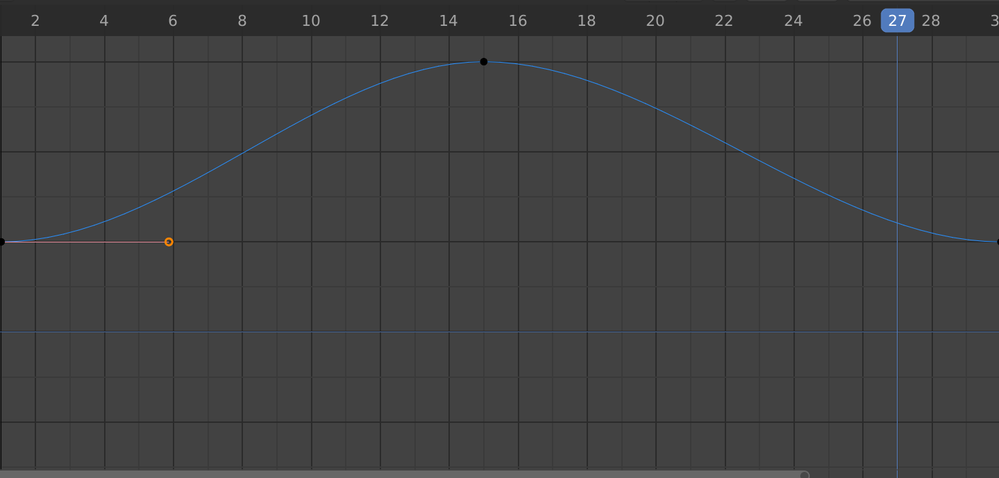
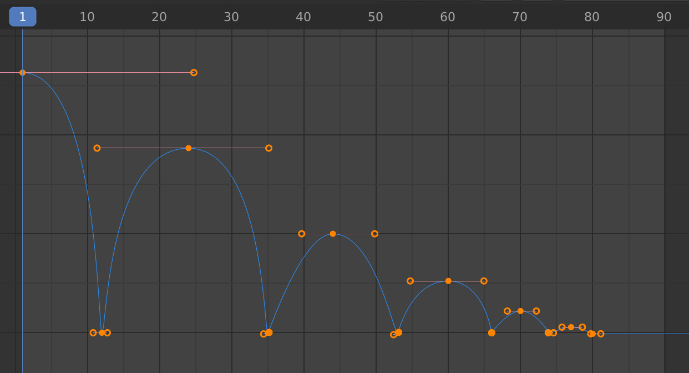

# Blender Bouncing Graph

## Setup

Setup a `30` frame scene, where a ball goes from resting on a plane at `0` frames to `3m` above it at `15` frames, back to resting on it a `30` frames.

When hitting play, the "ball" should "bounce" over and over on the plane.

## Graph

To animate the graph for a bouncing animation, with this graph as the starting point:

1. Starting with a default animation that moves a sphere up, and then back down.
2. Select the right side handle for the first keyframe, hit `G` and drag the mouse over towards the left.
3. Do the same for the farthest right keyframe, select the left side of the handle and drag it over towards the right.
4. Select the center handle for the middle keyframe, hit `S` to scale and move the top handle longer horizontally. (It's useful to play the animation here and adjust the bounce visually.)

## Frames

1. Set `Output Properties > Dimensions > End: 90`.
2. Move the playhead to `45`, then set the sphere's `Location > Z: 2m` (this should create a new keyframe at `45`).
3. Select the keyframe at `30` (for the ball in its resting state), duplicate it with `⇧D`, then click `X` to only move it along the X-axes, and move it to frame `60`.
4. Improve the first bounce by taking selecting the left handle of the `30` keyframe, and hitting `g` then `x` to move the handle in tight close the midpoint.
5. Select the middle of the `45` keyframe and hit `s` to scale it larger, again playing the animation (`⇧←` to go to the beginning, then `␣` to play) to get the feel right.

## Last Bounce

1. Move the playhead to `75` and hit `i` and select `Only Selected Channels` to insert a keyframe. Do the same at `90`.
2. Move the `Z Location` up at `75`, and select the middle of the keyframe and hit `s` to scale it larger. 
3. Improve the bounce by taking selecting the right handle of the `60` keyframe, and hitting `g` then `x` to move the handle in tight close the midpoint.
4. Do the same for the `90` keyframe left handle, hit `g` then `x` to move the handle in tight close to the midpoint.

## Durations

Each bounce should get progressively shorter.

1. Drag and select all the points starting from `30` to the end (so the last two bounces). Select `2D Cursor`, from the `Pivot Point` dropdown. Hit `s` `x` and drag to the left until the third bounce ends at `75`.
2. Move the playhead to in between the second and third bounce, and select all the points to the right of the playhead (i.e., the last bounce). Hit `s` `x` and drag to the left to move the end of the last bounce to `70`.

## Ending Ripple Bounce

Add a final couple of small bounces.

1. Move the playhead to `75` and hit `i` and select `Only Selected Channels` to create a keyframe. Do the same at `80`, `85`, and `90`.
2. Select the points at `75` and `85`, and hit `g` `y` to drag those points up slightly.
3. Use the same techniques as above to make adjustments:
    1. The second peak should be smaller than the first.
    2. Tighten the right and left handles of the keyframes at `0`.
    3. Scale the width of the second bounce smaller than the first.

## Improve Speed

Make the animation faster by scaling the entire animation smaller, and center the animation in the timeline, then add a drop starting from high in the air on the left.

1. Put the playhead at `0` and select all the points, select `2D Cursor`, from the `Pivot Point` dropdown, hit `s` `x` to scale the entire animation smaller by dragging to the left.
2. Select all of the points and hit `g` `x` and drag it to the right until it's in the center of the timeline.
3. Move the playhead to frame `1`. Hit `i` and select `Only Selected Channels`, then use `g` `y` to drag the new point higher than the first bounce.
4. Select the left handle at the start of the first bounce, and use `g` `x` and drag to the right to shrink it. Select middle of the handle at keyframe at `0`, and hit `s` `x` to scale it larger, so there's a nice curve.

