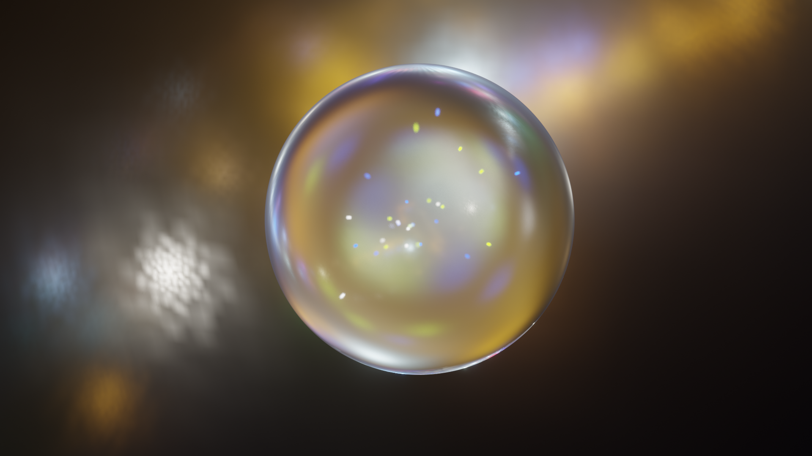
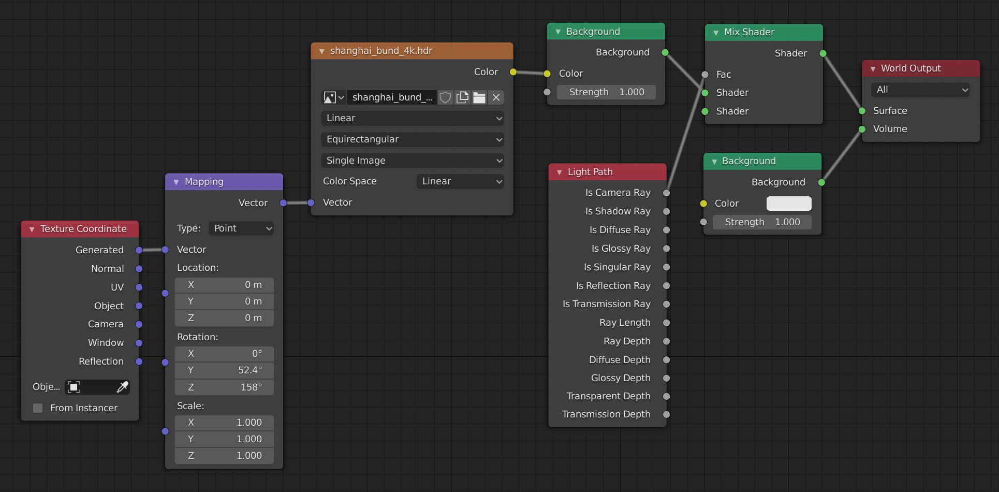

# Blender Glass Particle Sphere

## Sphere

1. Create a new document and delete the starting cube and light.
2. Add a UV Sphere.
3. Scale the sphere up by selecting it and typing `s4`.
4. Add a subdivision modifier, and set `Render: 3`, `Viewport: 3`, `Quality: 3`
5. Click `Apply` on the modifier
6. Right-click and select `Shade Smooth`

## Material

1. Switch `Viewport Shading` to `Material Preview` (`Z`).
2. To configure the preview, open the `Shading` pop-up menu to the right of `Viewport Shading` (`z Numpad-2`). To choose lighting, click the sphere in the `Shading` pop-up menu and choose `Studiolight` example (hover the example spheres to see their names).
3. Go to `Material Properties` and click `New`. Name the new material `Sphere Glass`. Under `Surface`, set `Surface: Glass BSDF`, `Roughtness: 0.233`, and `IOR: 1.39`.
4. Under `Settings`, Toggle on `Backface Culling`, set `Blend Mode: Alpha Blend` and `Shadow Mode: None`. Toggle on `Screen Space Refraction`.

## Render Options

1. Under `Render Properties`, toggle on `Bloom` and `Subsurface Scattering > Screen Space Reflections`.
2. Under `Subsurface Scattering > Screen Space Reflections`, turn on `Refractions`, turn off `Half Res Trace`. Set `Trace Position` and `Max Roughness` to the maximum (`1`).

## Particles

### Creating

1. Add a UV Sphere (`⇧A`, then `Mesh > UV Sphere`), rename it to `Emitter`.
2. Set `Object Properties > Transform > Scale: 0.1, 0.1, 0.1`.
3. Add another UV Sphere (`⇧A`, then `Mesh > UV Sphere`) and drag it outside of the other spheres with `G`.
4. Duplicate the new sphere (`⇧D` then enter) two times, and move them out so there's three spheres in a row.
5. Name the three spheres `Particle 1`, `Particle 2`, and `Particle 3`.

### Materials

1. Select `Particle 1`, create a new material and name it `Particle 1`. Choose `Surface: Emission`. Choose a green for `Color`. Set `Strength: 25`.
2. Repeat the same for `Particle 2` and `Particle 3`: Create a material for each with their name, choose `Surface: Emission`, and set `Strength: 25`. Set the `Color` for `Particle 2` to white (the default), and blue for `Particle 3`.

## Clean Up

1. Select all three spheres, then with `G Z` move them high in the scene away from the main sphere so they're out of the scene.
2. Make a collection called `Particles`, and move the three particle spheres into it.

## Emitter

1. Click the `Emitter`, then under `Particle Properties`, click the plus button. Set `Emission > Number: 100`
2. In the timeline, set `End: 300` for the number of frames.
3. Set `Emission > Lifetime: 95`, to extend how long the particles will exist in the scene. (Note the faint red line in the timeline shows how long the particles will be visible in the scene).
4. Set `Field Weights > Gravity: 0`, Toggle off `Render > Show Emitter` and `Viewport > Show Emitter`, choose `Render > Render As: Collection`, choose `Render > Collection > Instance Collection: Particles`, toggle on `Render > Collection > Pick Random`.
5. You should now be able to see particles during playback, it looks better if you turn off overlays.
6. Set `Particle Properties > Render > Scale: 0.3`

## World Shading

1. Click the `Shading` tab along the top.
2. In the bottom pane, select the shader data as `World`.
3. Zoom out and pan until you find the default `Background` and `World Output` (there usually above your default position somewhere).
4. Add a `Shader > Background`, and connect the `Background: Background` output to the `World Ouput: Volumne` input.
5. Add a `Mix Shader` between the first `Background` and `World Output`.
6. Add a `Texture > Environmental Texture` and connect its `Color` output to the top `Background: Color` input.
7. add a `Vector > Mapping` and connect the `Mapping: Vector` output to the `Environmental Texture: Vector` input.
8. Add a `Input > Texture Coordinate` and connect its `Generated` output to `Mapping > Vector` input.
9. Add a `Input > Light Path` and connect its `Is Camera Ray` output to the `Mix Shader: Fac` input.

## Add an HDRI

1. In the `Environment Texture` node, click `Open` and select an HDRI. (You can play with the `Mapping > Rotation` parameters here to change the rotation of the HDRI.)

## Camera

1. Click the `Layout` tab along the top.
2. Center the sphere nicely and choose `View > Align View > Align Active Camera to View` to align the camera.
3. Select the `Camera` and set it's rotation and position:
    - `Location`
        - `X: 2.2`
        - `Y: -28`
        - `Z: 7.3`
    - `Position`
        - `X: 75`
        - `Y: 0.82`
        - `Z: 4.98`

## Background

1. Add a `UV Sphere` (if it gets added to the `Particles` collection, then drag it to `Collection`). Rename it to `Sphere Background`.
2. Zoom out until you can see both the sphere and the camera, then scale up the `Sphere Background` until it contains the camera (`S` and then drag).
3. Add a `Subdivision Surface` modifier to `Sphere Background`, with `Render: 3` and `Viewport: 3`. Then apply it (`Apply` button).
4. Smooth `Sphere Background` more by right-clicking and choosing `Shade Smooth`.

## Background Material

1. Make a new material called `Sphere Background`
2. Set the `Base Color` to black, `Roughness: 0.250`

## Variations

1. By going to the `Shading` tab and viewing through the camera (`Numpad 0`), you can then change the `Mapping > Rotation` to change the rotation of the HDRI which changes the colors in the sphere.
2. Select the `Emitter` and increase the number of particles `Emission > Number`.