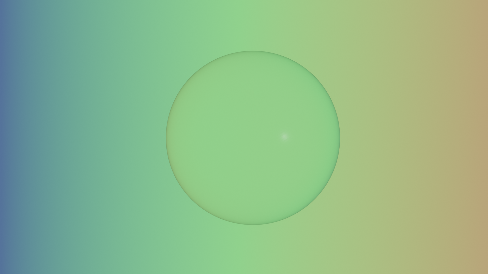
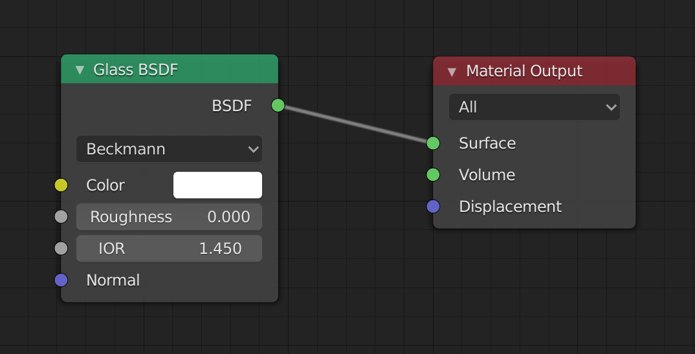
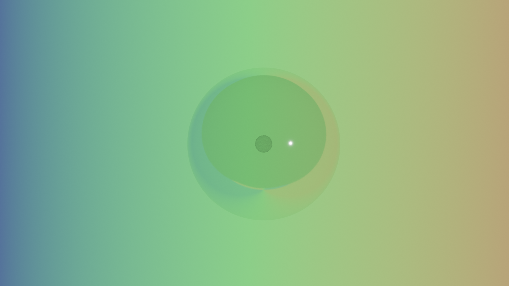
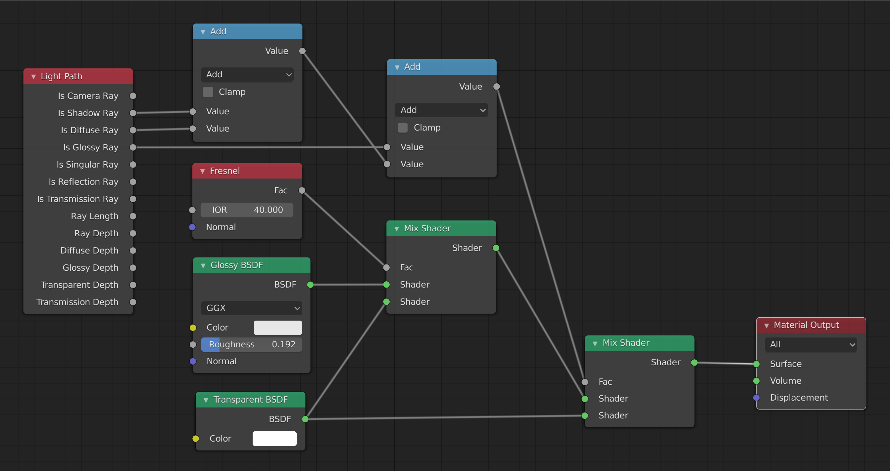

# Blender Glass Sphere

## Eevee

### Method 1

Note that this method does not use the node editor at all.

1. In "Object Mode", select the light source, and under "Object Data Properties" (the light bulb icon), select "sun", and set specular to `0`.
2. Select the cube and create a new material under "Material Properties", set the "Roughness" to `0`, and "Transmission" to `1`, and turn on "Screen Space Refraction".
3. Go to "Render Properties" and turn on "Screen Space Refractions", and under that, "Refraction".
4. The object should now look transparent.

### Method 2

Note that this method does not use the node editor at all.

1. Add a UV Sphere.
2. Add a `Subdivision Surface` modifier, and set `Render: 3`, `Viewport: 3`, `Quality: 3`.
3. Click `Apply` on the modifier.
4. Right-click the sphere and select `Shade Smooth`.

#### Material

1. Switch `Viewport Shading` to `Material Preview` (`Z`).
2. Open the `Shading` pop-up menu to the right of `Viewport Shading`. Click the sphere and choose `Studiolight`.
3. Go to `Material Properties` and click `New`. Name the new material `Sphere Glass`. Under `Surface`, set `Surface: Glass BSDF`, `Roughtness: 0.233`, and `IOR: 1.39`.
4. Under `Settings`, Toggle on `Backface Culling`, set `Blend Mode: Alpha Blend` and `Shadow Mode: None`. Toggle on `Screen Space Refraction`.

#### Render Options

1. Under `Render Properties`, toggle on `Bloom` and `Subsurface Scattering > Screen Space Reflections`.
2. Under `Subsurface Scattering > Screen Space Reflections`, turn on `Refractions`, turn off `Half Res Trace`. Set `Trace Position` and `Max Roughness` to the maximum (`1`).

## Cycles

Both of these methods use the same setup.

1. Set "Render Properties > Render Engine: `Cycles`".
2. Add an Ico Sphere (`A` then "Mesh > Ico Sphere"), set "Radius: `10m`" and "Subdivisions: `6`"
3. Add a HDRI background (under "World Properties", leave the default as "Surface: `Background`, and set "Color: `Environment Texture`". Click the folder icon to select your image.)
4. Add a material to the sphere (select the "Sphere" then select "Material Properties" in the sidebar and click the "New" button)
5. Select the "Shading" tab on the top, in the "Shader Editor" (just be automatically set as the bottom split under the Shading tab), delete the default "Principled BSDF" (select it, then `X`).

### Method 1

This method seems to work well with either an `Ico Sphere` or a `UV Sphere`.

1. Add a "Shader > Glass BSDF" and connect the "BSDF" output to the "Surface" input.

)

#### Removing Distortion

1. Go to "Blender Properties" and toggle on "Film > Transparent", and "Transparent Glass". (Note that this removes the HDRI background, you will no longer see the background when rendering, instead you will only see reflections in the glass object).

### Method 2

)

This method seems to work better wtih an `Ico Sphere`.

1. Add an "Input > Light Path", add two "Converter > Math" nodes.
2. Connect the output of "Light Path: `Is Shadow Ray`" to the first "Add: `Value`" and output of "Light Path: `Is Diffuse Ray`" to the second "Add: `Value`". Connect the "Add: `Value`" output to the bottom "Add: `Value`" input. Connect the "Light Path: `Is Glossy Ray`" output to the top "Add: `Value`" input.
3. Add a "Shader > Glossy BSDF", a "Shader > Transparent BSDF", and a "Shader > Mix Shader". Connect the "Glossy BSDF: `BSDF`" to the top "Mix Shader: `Shader` input, and the "Transparent BSDF: `BSDF`" to the bottom "Mix Shader: `Shader` input.
4. Add an "Input > Fresnel", connect the "Fresnel: `Fac`" output to the "Mix Shadow: `Fac`" input, and set "IOR: `40`".
5. Add a "Shader > Mix Shader" and connect the first "Mix Shader: `Shader`" output to the top new "Mix Shader: `Shader`" input. Connect the "Transparent BSDF: `BSDF`" output to the bottom new "Mix Shader: `Shader`" input. Connect the second "Add: `Value`" output to the new "Mix Shader: `Fac`" input.
6. Connect the new "Mix Shader: `Shader`" output to the "Material Output: `Surface`" input.

)

#### Clean Up

1. Adjust the "Glossy BSDF: `Roughness`", lower values means the glass will be shinier.