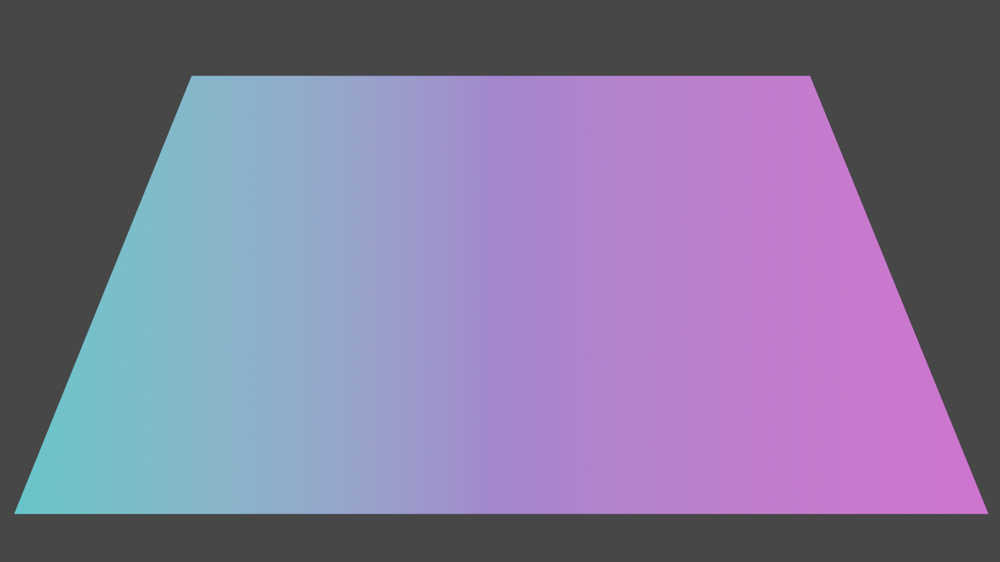

# Blender Gradient Background

There are different beginning and ending steps based on whether the gradient is applied to the world or to a plane.

## World Setup

To apply the gradient to the world:

1. In `World Properties`, make sure `Use Nodes` is selected (it should be blue).
2. Drag up the bottom split, and switch to the `Shader Editor`. Select `World` in the upper left (from `object`).

## Plane Setup

To apply the gradient to a plane:

1. Add a plane (`⇧A`, `Mesh > Plane`)
2. Under `Material Properties`, click `New`, make sure `Use Nodes` is selected (it should be blue).
3. Switch to the `Shading` tab.
4. Make sure `Object` is selected on the upper-right of the bottom pane.
5. Delete the "Principled BSDF" that's in the Shader Editor by default.

## Node Editor

These steps are the same for a plane or a world gradient.

1. Add a `Texture Coordinator` node
2. Add a `Mapping` node, and connect the `Texture Coordinate > Window` output to the `Mapping > Vector` input.
3. Add a `Gradient Texture`, and connect the `Mapping > Vector` output to the `Gradient Texture > Vector` input.
4. Add a `ColorRamp` node, and connect the `Gradient Texture > Color` output to the `ColorRamp > Fac` input.

## World Finish

The `World` should have existing `Background` and `World Output` nodes, with the `Background` output of the `Background` connected to the `Surface` input of the `World Output`.

1. Attach the `Color` output of the `ColorRamp` into the `Color` input of the `Background`.

## Plane Finish

The `Object` should have an existing `Material Output.

1. Attach the `Color` output of the `ColorRamp` into the `Surface` input of the `Material Output`.

## Nodes

## Notes

- To change to a radial gradient, select "Spherical" in the "Gradient Texture" node.
