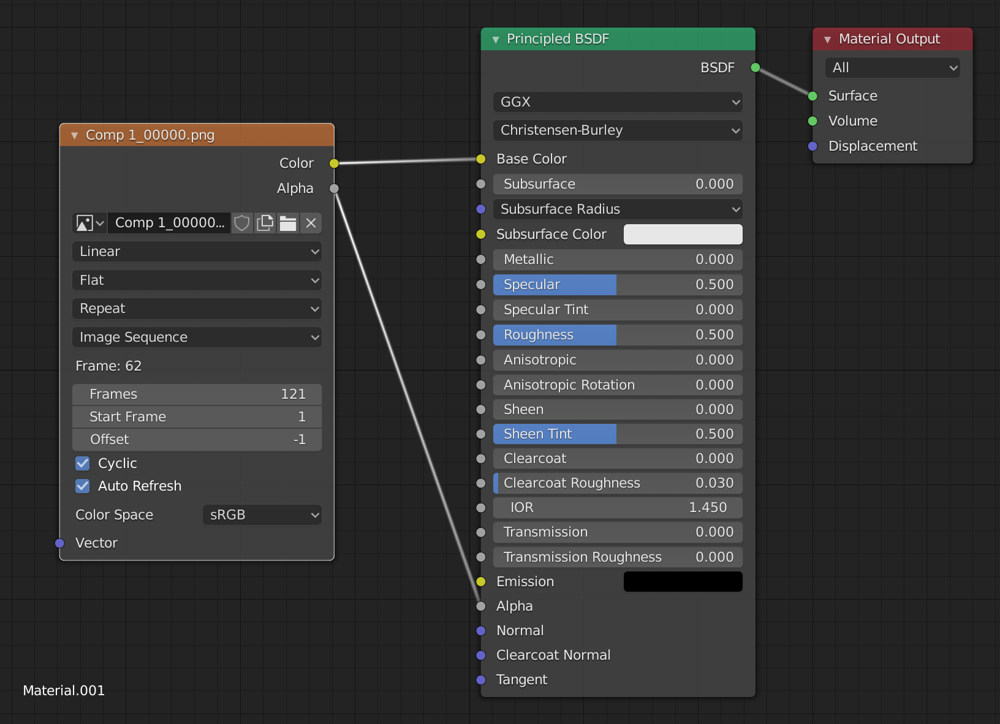

# Blender Image Sequence Plane

<video controls>
  <source src="assets/blender-image-sequence.mp4" type="video/mp4">
</video>

1. Make a plane.
2. Switch to the `Shading` tab
3. Click the `New` button in the bottom `Object` split to create a new material.
4. Add an `Image Texture` node, click the `Open` button and select the first image in the sequence. Connect the `Color` output to the `Principled BSDF > Base Color` input.
5. Change `Single Image` to `Image Sequence`
6. Toggle on `Auto Refresh` and `Cyclic`
7. Connect the `Alpha` output to the `Principled BSDF > Alpha` input.

## Transparency

1. Set `Frames:` to the number of different images in the image sequence.
2. Switch back to the `Layout` tab
3. To remove the black background and display transparency, set `Material Properties > Settings > Blend Mode: Alpha Clip`

## Render

1. To see the animation, switch to `Viewport Shading: Rendered` (`z Numpad-8`), and click play.

