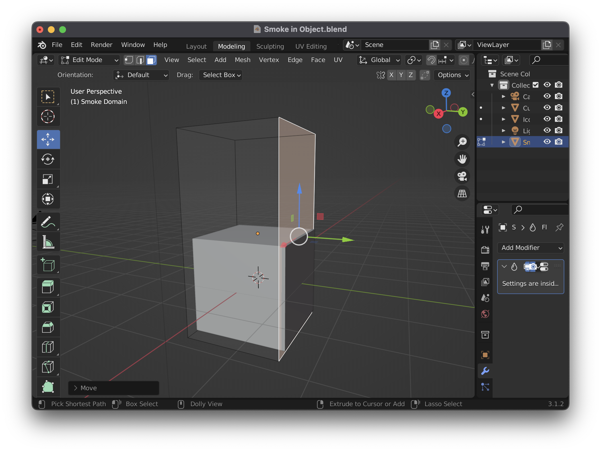

# Blender Smoke in Object

## Setup

1. Position the cube straight on by switching the camera to `Lock Camera to View` (select `View > Cameras > Active Camera`, then `n` to bring up the side panel, `View > Lock > Camera to View` in the side panel). Use the navigation controls to position the camera.
2. Add an `Ico Sphere` (`A`) and scale it down to `0.143` for XYZ
3. With the `Icosphere` selected, choose `Objects > Quick Effects > Quick Smoke`
4. Switch to `Shading > Wireframe` with `z w`. If you play now you'll see smoke emerging from the `Icosphere`, but going right through the cube.

## Confine to the Object

1. Select the `Cube`, and select `Physics Properties` and turn on `Fluid`, then select `Effector` in the `Fluid` section, and toggle on `Settings > Is Planar`. Set `Settings > Surface Thickness: 0.00001` (setting the `Surface Thickness` appears to be optional)
2. "Reset the domain type" for the `Smoke Domain` by selecting `Smoke Domain > Physics Properties > Fluid > Settings > Domain Type: Gas` (just re-select `Gas`). After doing so, and re-playing the scene, the smoke should no longer be moving.
3. Toggle on `Smoke Domain > Fluid > Adaptive Domain`, and set `Adaptive Domain > Margin: 2`
4. Reset the domain type and play again and the smoke should move, but then get stuck around frame 70. This is because when playing the animation, the smoke domains bounding box gets larger, and eventually all four edges are outside of the cube. The smoke domain stops playing when it no longer has an edge inside the cube.
5. To assure the smoke domain always has an edge inside the cube, move the back edge (farthest from the camera) so it intersects with the cube. Go to `Modeling` tab, select `Move` tool, use `Select Mode: Face`. Click the edge to move, and then visually move it inside the cube.

    

6. While we're resizing, it's also a good idea to move the top edge down so it's just like the other edges which sit right outside the sides of the cube.
