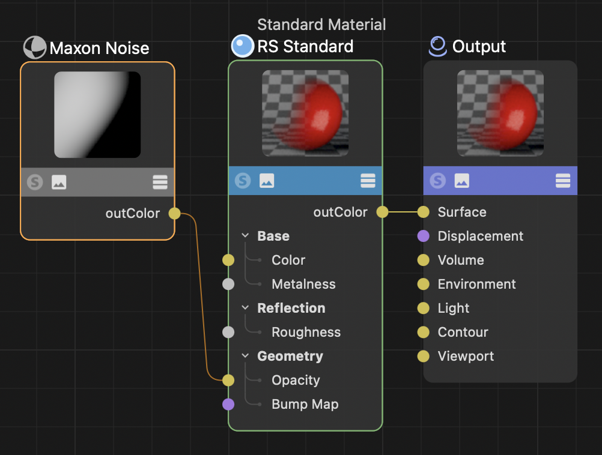

# Cinema 4D Tasks Noise Loop Opacity

1. Create a new default material (double-click in the `Material Manager`
2. In the `Node Editor`, add a `Maxon Noise` (`C`)
3. Connect the `Maxon Noise > outColor` output to `RS Standard > Opacity` input
4. Set the `Speed` and `Loop Period` to loop the noise

## Preview

Once the opacity setting is setup, the IPR will be slow, so it's good to get the noise, speed, and loop period settings right by projecting the noise on onto the object as a color for the material to test those values before switching it to opacity.

## Settings

- `Speed: 1`
- `Loop Period: 4`
- `Input > Overall Scale: 1000`
- `Output > Brightness: -0.1`
- `Output > Contrast: 0.8`

## Other Settings

- `General > Type`: `Luka`, `Naki`, `Nutous`, `Ober`, `Pezo`, `Stupl`, `Vornoi 2`, `Fire`, `Electric`, `Gaseous`, `Ridged Multi Fractal`