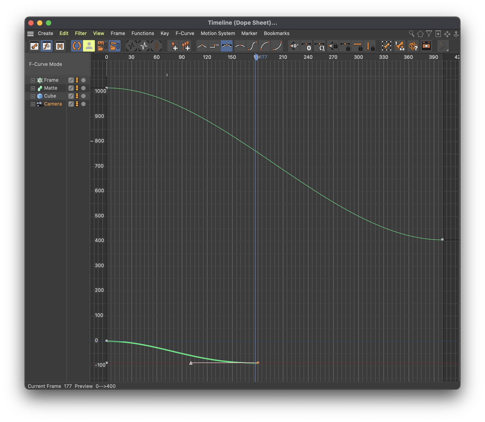
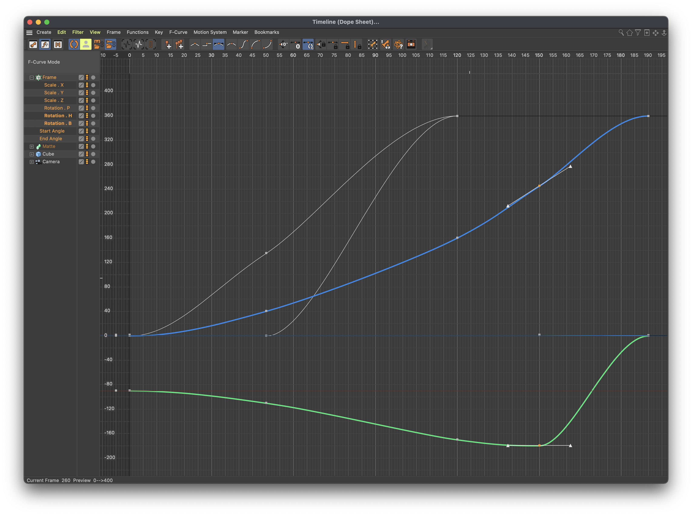

# Cinema 4D Cineware

## Setup

1. For this tutorial, set `Preferences > Units > Units Display: Inches`
2. Add a Cube, and under `Object`, set `Size: 70 70 70` and set `Fillet Radius: 1`
3. Add a Camera, and under `Coord.`, set `P: 0 400 0`, and `R: 0 -90 0`
4. Click the Camera's view finder icon in the Object Manager to view through the camera, it should be viewing straight down on the object
5. Add a plane and scale it up so it fills the camera view vertically
6. Switch to the four quadrant view (`Panel > All Views` or `F5`) and drag the plane backwards in the front view so it's not intersecting the cube
7. Rename the `Plane` to `Floor`
8. Drag the `Cube` to the top of the Object Manager, so the order is `Cube`, `Floor`, `Camera`
9. Set the `Cube` `Coord. > R . B: 45`

## Rotation Effect

1. Under `Spline Pen`, insert a `Rectangle`
2. Hit `R` for rotate and rotate the rectangle 90 degrees
3. Under `Rectangle > Object > Object Properties`, set `Width: 140` and `Height: 140`
4. Duplicate the `Rectangle`, and set the duplicate to `Width: 5` and `Height: 5`, toggle on `Rounding`, and set `Radius: 0.4`.
5. Add an `Extrude > Sweep`, and drag `Rectangle` and `Rectangle.1` to be children of it, rename `Rectangle` to `Outer`. (`Outer` is providing the shape, and `Rectangle.1` is providing the width.)
6. Turn on `Display > Gouraud Shading (Lines)`
7. Select `Sweep` and click `Cloner`. Drag `Sweep` under the `Cloner`. Under `Cloner > Object`, set `Mode: Radial`, `Count: 5`, and `Plane: XY`
8. Under `Cloner > Object`, set `End Angle: 0`
9. `⌘-drag` a duplicate of `Cloner > Sweep` out to above `Cloner`. In the `Sweep` copy, scale the `Outer` a bit (to around `128 in`), and set the `Rectangle.1 > Object > Width: 13`.
10. Rename `Sweep` to `Matte`
11. Drag the `Matte` under `Sweep > Outer` (this is so the `Matte` will animate together with the `Sweep`)
12: Rename `Cloner` to `Frame`

## Animation

1. Change the total frames to `400`
2. Turn on `Autokeying` (`⌘F9`)

### Cube

1. Go to frame `0`, and record a key frame (`F9`)
2. Go to frame `40`, and under `Cube > Coord.`, set `R . H: -10`, `R . P: 15`, `R . P: 19`
3. Go to frame `90`, and under `Cube > Coord.`, set `R . H: -35`, `R . P: 45`, `R . P: -45`
4. Go to frame `120`, and under `Cube > Coord.`, set `R . H: -50`, `R . P: 12`, `R . P: -90`
5. Go to frame `150`, and under `Cube > Coord.`, set `R . H: -60`, `R . P: -25`, `R . P: -125`
6. Go to frame `210`, and under `Cube > Coord.`, set `R . H: 0`, `R . P: -90`, `R . P: -90`

### Frame

1. Move the playhead to frame `0`, and under `Frame > Object`, toggle on keyframes for `Start Angle` and `End Angle`. Under `Frame > Coord.`, toggle on keyframes for `S . X`, `S . Y`, and `S . Z`, also `R . X`, `R . Y`, and `R . Z`. Set `Frame > Coord. > R . H: -90`.
2. Go to frame `50` and under `Frame > Object`, set `Start Angle: 135`, and `End Angle: 0` (actually enter `0` so it creates a keyframe). Under `Frame > Coord.`, set `R . H: -110`, `R . B: 40`
3. Go to frame `120`, and under `Frame > Coord.`, set `R . H: -170`, `R . B: 160`. Under `Frame > Object`, set `Start Angle: 360`, and `End Angle: 360`
4. Go to frame `150`, and under `Frame > Coord.`, set `R . H: -180`, `R . B: 245`. Click the key frame buttons for `S . X`, `S . Y`, and `S . Z`
5. Go to frame `190`, and under `Frame > Coord.`, set `S . X: 0.5`, `S . Y: 0.5`, and `S . Z: 0.5`. Set `R . H: 0`, `R . P: 0`, and `R . B: 360`.
6. Go to frame `120`, and under `Cube > Object`, toggle on key frames for all three size properties
7. Go to frame `210`, and under `Cube > Object`, set all three size properties to `20`

### Clean Up

1. Select `Floor`, and move it backward with the move tool (`E`) so it's no longer intersecting with the animation, then scale it up (`T`) to fit the background.

### Camera

1. Go to frame `0` and under `Camera > Coord.`, set `P . X: 0`, `P . Y: 400` and `P . X: 0`. Turn on the keyframes for all three position and rotation parameters.
2. Go to frame `400` and under `Camera > Coord.`, set `P . Y: 160`
3. Go to frame `180` and under `Camera > Coord.`, set `P . Y: 160`, set `R . H: -90`

## Ease Animation

1. `Window > Timeline (F-Curve)...`, select `Camera`, and hit `⌘A` to select all, then hit `S` to bring the selected curves into view.
2. For the lower curve, the `Camera > Rotation . H`, drag right handle farther inward to ease the animation more.

    

3. Select `Frame` and delete the following two key frames (which aren't doing much):

    

## Sweep

1. `⌘Drag` the `Frame > Sweep` to a first level `Sweep`
