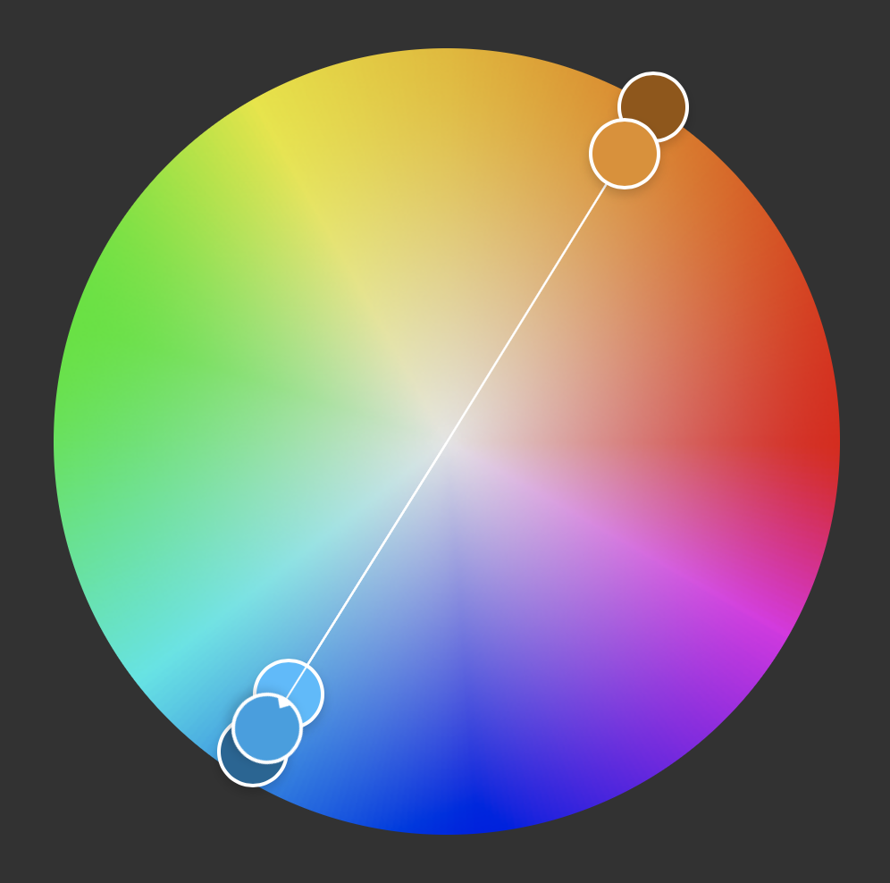

# Color

- *Hue*: Color
- *Saturation*: Intensity or vividness
- *Luma*: Brightness or shade

## Primary

Red, yellow, and blue are usually the primary colors in art ("RGB").

## Complementary

Complementary colors are opposite on the color wheel. Complementary colors are usually a cool color paired with a warm color. When positioned next to each other, they make each color appear more intense.

## Hex

These colors are based on RGB, which uses additive color.

- **Black**: `(0, 0, 0)`, `#000000`
- **White**: `(255, 255, 255)`, `#FFFFFF`

### Primary

- **Blue**: `(0, 0, 255)`, `#0000FF`
- **Green**: `(0, 255, 0)`, `#00FF00 `
- **Red**: `(255, 0, 0)`, `#FF0000`

### Secondary

- **Yellow** (Green/Red): `(255, 255, 0)`, `#FFFF00`
- **Magenta** (Blue/Red): `(255, 0, 255)`, `#FF00FF`
- **Cyan** (Blue/Green): `(0, 255, 255)`, `#00FFFF`

#### Half

- **Orange** (Red/Yellow): `(255, 102, 0)`, `#FF6600`
- **Purple** (Blue/Red): `(102, 0, 255)`, `#6600FF `
