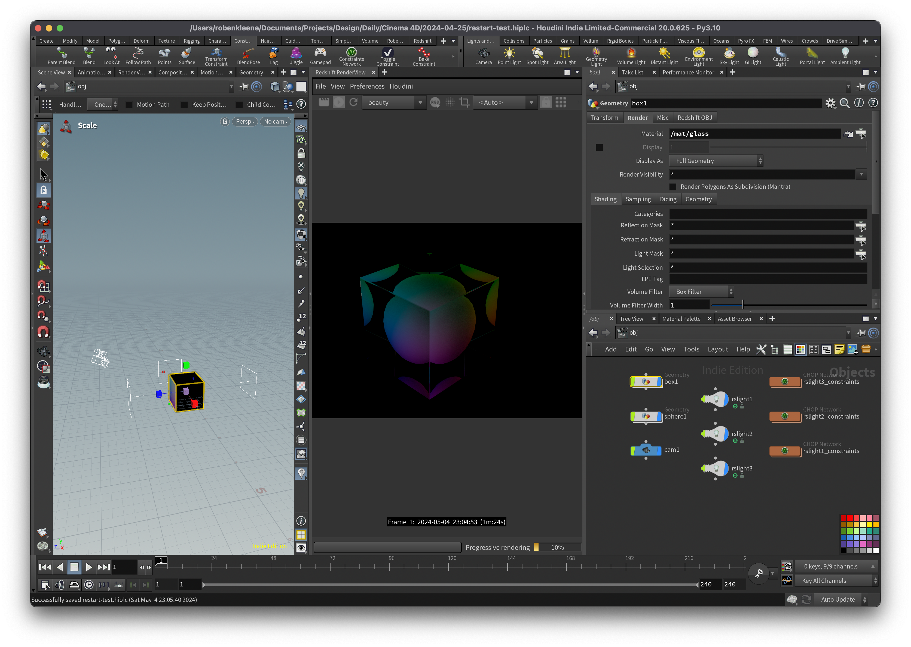

# Houdini Colored Refraction Sphere

## `/obj`

1. Add a `box` and `sphere`
2. Scale down the sphere a bit or it will look wrong
3. In the `box1` network, add `PolyBevel` and attach the `cube1` to its input
4. Set `polybevel1 > Distance: 0.01`
5. Add a `Color`
3. Connect the output of the `box1` to the input of the `color1`
4. Set `color1 > Color Type: Bounding Box` (this adds gradient `Cd` values to the cube)

## `/mat`

1. Add a simple material for the sphere and assign it to it
2. Add a `RS Material Builder` for the cube
3. In the cube material, delete the `RS Standard` and replace it with an `RS Material`
4. Add a `RS User Data Color` and attach it's output to the `Refraction Color` input
5. Under `Material1`, set `Diffuse > Weight: 0` (so the cube is clear) and `Refraction/Transmission > Weight: 1` (so the cube refracts light) `Reflection > Weight: 0` (so the cube doesn't have light artifacts from the lights)

## `/obj`

1. Add three area lights around the objects
2. In the toolbar, add `Constraints > Look At` constraints to the three lights so they look at the cube
3. Adjust the intensity of the lights
