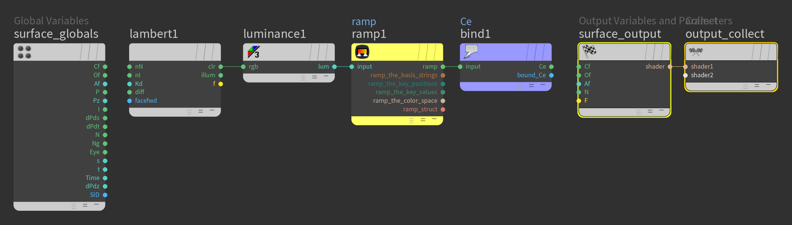

# Houdini Cartoon Shader

## Setup

1. Add a `Geometry` node, rename it to `MESH`
2. Add a `Test Geometry: Squab`, and uncheck `Add Shader`.
3. Create a new camera.

## Material

1. Switch to the `mat` network and add a `Material Builder`. Rename it to `cartoon`.
2. Go into `cartoon` and delete the two displacement nodes, so only `surface_globals`, `surfice_output`, and `output_collect` remain.
3. Add a `Bind Export`. Set `Name: Ce` (for "color emission"), and `Type: Vector (vector)`.
4. Add a `Lambert` and a `Luminance`, attach the `lambert1: clr` output to the `luminance1: rgb` input.
5. Add a `Ramp Parameter` and attach the `luminance1: lum` output to its `input` input. Attach its `ramp` output to the `bind1: input` input.

## Render Node

1. From the menu, choose `Render > Create Render Node > Mantra - PBR`.
2. Go to the `obj` network, select the `MESH`, under `Render` properties, set `Material: /mat/cartoon` (click the icon to the right of `Material`).

## Cartoon Shader

1. At the top level of the `mat` network, select `cartoon`, and set `ramp > Interpolation: Constant`. Adjust the gradient sliders to the bar is half black and half white.