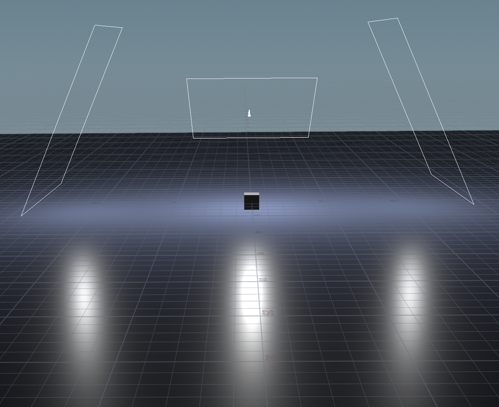

# Houdini Donut Render

This tutorial describes how to setup a render of an object on a plane. It goes through the steps of adding a plane, applying materials, and setting up lighting and cameras.

## Add Plane

1. If your scene doesn't already have a subject, add a cube (`box`)
2. At the top `obj` level, add a `grid`.
3. Switch to the `Move` tool (`T`), and lower the grid so it isn't intersecting the subject (hit `⎋` when finished).
4. To make it bigger, set the `Uniform Scale` of `grid1` to `10`.
5. Double-click `grid1` to enter it, and add a `Normal`, attach the output of `grid1` to the input of `normal1`.

## Assign Plane Material

1. Switch to the material network, by choosing `mat` from the pop-up menu at the top of the network viewer.
2. Add a `Classic Shader` and rename it to `BG`.
3. Set the `BG > Reflect Base > Roughness` to `0.3`.
4. Under `BG > Diffuse`, toggle off `Use Point Color`, and change the color to blue by setting `Base Color: 0.25 0.3 0.5`.
5. Assign the material by selecting the `grid1` in the `obj` network and choosing the material under `Render > Material` (click the `Open floating operator chooser` to its right).

## Add Camera & Light

1. Add a camera by `⌃`-clicking the `Camera` icon, and click the lock icon in the sidebar to lock it to the view.
2. Add a light by `⌘`-clicking the `Area Light` icon. (Hit `⎋` to exit the manipulator controls.)
3. Adjust the camera and light roughly by moving them around both locked. Then unlock them and zoom out of the scene to make further adjustments.
4. Select `arealight1` and set `Area Size: 8x8`.
5. Adjust the `arealight1` `Intensity` and `Exposure` to get the lighting right.

## Rendering

1. Go to the `Render View` and hit `Render`.
2. After hitting the `Render` button, in the `out` network, there will be a `mantra_ipr` node to configure the render.
3. Under `mantra_ipr > Rendering` set `Rendering Engine: Physically Based Rendering`.
4. Under `mantra_ipr > Rendering > Limits`, set `Diffuse Limit: 4`, `Reflect Limit: 6`, `Refract Limit: 6`. (These changes are the brighten the image.)

## Adding More Light

1. Cut and paste `arealight1` creating `arealight2`
2. From the camera pop-up in the upper right of the viewport, select `Look Through Light > arealight2` to view through the new light.
3. Click the `Lock camera/light to view` icon in the sidebar on the right to move `arealight2`. Move the light somewhere that fills in the scene a bit more.
4. Add a third light and do the same.
5. For `arealight1` (the main center light), set `Exposure: 1` and `Intensity: 20`.
6. For lights `arealight2` and `arealight3` (the two side lights), set `Exposure: 1`, `Intensity: 7`, and `Area Size: 12, 12`.

