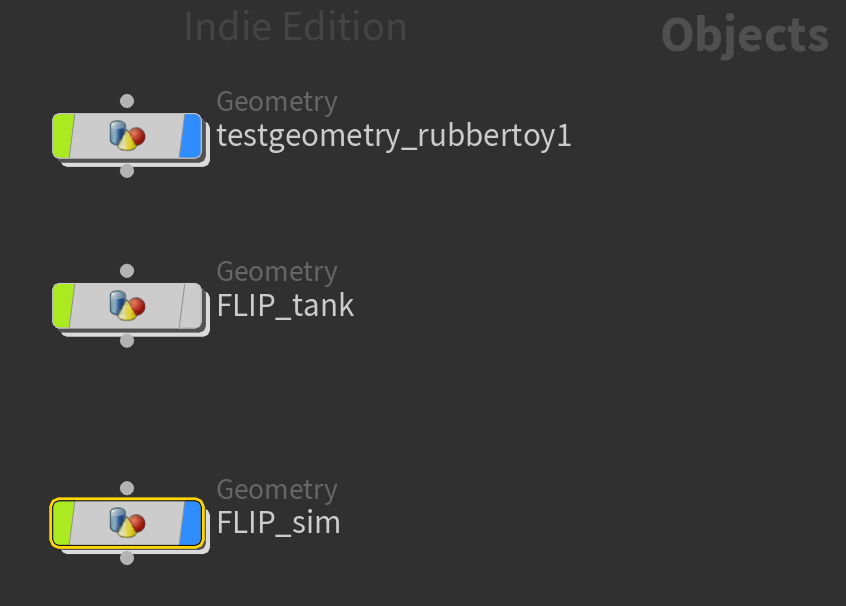
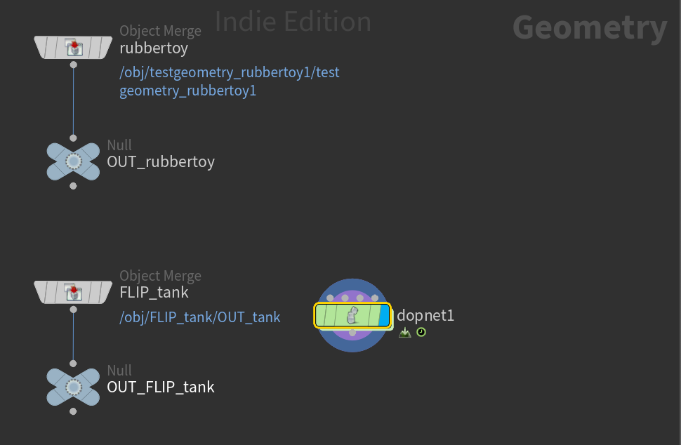
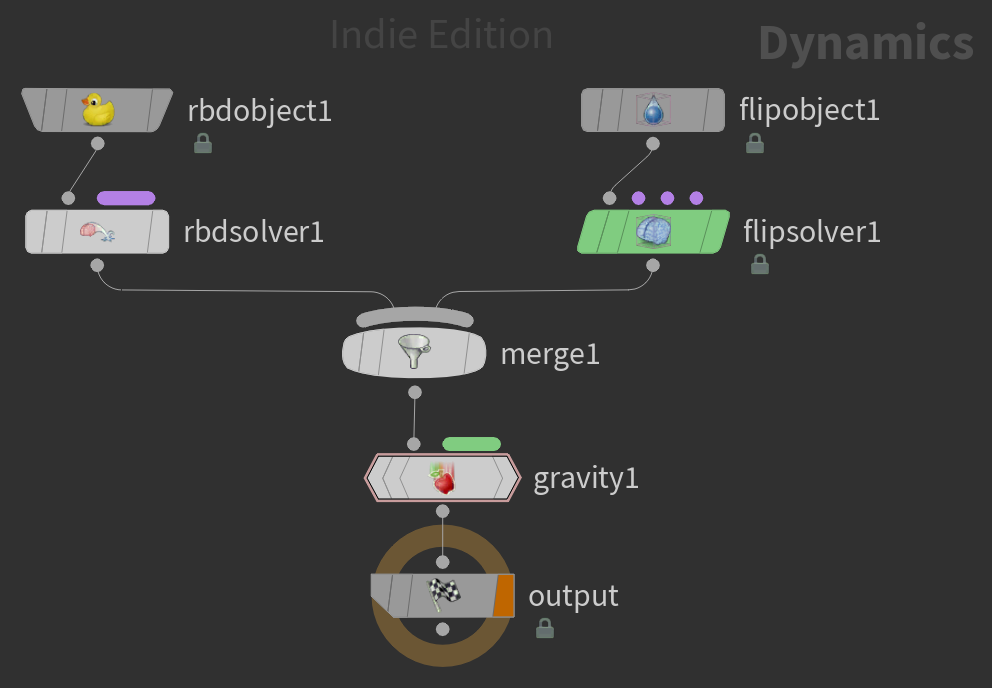

# Houdini FLIP Tank

## `/obj`

1. Add a `Test Geometry > Rubber Toy`
2. Add a `Geometry` node and call it `FLIP_tank`

## `/obj/FLIP_tank`

1. Double-click into `FLIP_tank` and a `Ocean Source` node
2. The `oceansource1` will immediately have an error because it's not made for a FLIP tank simulation, it's for the ocean tools. Select `oceansource1` and set `Surface Evaluation > Type: Flat` and the error will go away.
3. Select `FLIP_tank`, and toggle on `Particles > Fill Volume`
4. Add a `Null` and name it `OUT_tank` and connect the output of `oceansource1` its input.

## `/obj`

1. Go back to the top level (`U`)
2. Toggle off rendering of the `FLIP_tank`. (We're not going to render the tank itself, instead we're going to be rendering the water fluid.)
3. Add another `Geometry` node and call it `FLIP_sim`

## `/obj/FLIP_sim`

1. Double-click into `FLIP_sim` and add a `DOP Network` node

## `/obj/FLIP_sim/dopnet1`

1. Double-click into `dopnet1` and add a `FLIP Object`
2. Add a `FLIP Solver`
3. Add a `Gravity Force`
2. Connect the output of `flipobject1` to the leftmost `flipsolver1` input, connect the output of `flipsolver1` to the leftmost `gravity1` input, connect the output of `gravity1` to the `output` input

## `/obj/FLIP_sim`

1. Go up a level to `FLIP_sim` (`u`)
2. Add an `Object Merge` and call it `FLIP_tank`
3. Connect the output of `FLIP_tank` to a new `Null` called `OUT_FLIP_tank`
4. Set `FLIP_tank > Object 1: /obj/FLIP_tank/OUT_tank`
5. Add another `Object Merge` and call it `rubbertoy`
6. Connect the output of `rubbertoy` to a new `Null` called `OUT_rubbertoy`

## `/obj/FLIP_sim/dopnet1`

1. Double-click into `dopnet1`
2. Set `flipobject1 > Initial Data > SOP Path: ../../OUT_FLIP_tank` (zoom out and you should see an empty box representing the FLIP tank)
3. Set `flipobject1 > Properties > Guides > Particles > Visualization: Particles` (this is purely cosmetic for the viewport, makes the simulation appear as particles rather than the larger sprites in the viewport)
4. Set `flipobject1 > Properties > Initial Data > Input Type: Particle Field`
5. Right now the fluid particles will be much smaller than the size of the tank itself, to fix these, right-click `flipsolver1 > Volume Motion > Volume Limits > Box Size` and choose `Copy Parameter`.
6. Right-click `/obj/FLIP_tank > oceansource1 > Size` and choose `Paste Relative References`
7. Set `flipsolver1 > Volume Motion > Volume Limits > Box Size: 5 5 5`
8. Do the same `Copy Parameter`, `Paste Relative References` steps to make the `/obj/FLIP_tank > oceansource1 > Center` match the `flipsolver1 > Volume Motion > Volume Limits > Box Center`
9. Play the simulation now (`↑`), and you'll see the water just falls down. To fix this, Start by toggling on `flipobject1 > Properties > Closed Boundaries`

### Adding the Model

1. Add an `RBD Object` (rigid body), and set `rbdobject1 > SOP Path: ../../OUT_rubbertoy`
2. Add an `RBD Solver` and connect `rbdobject1` output to `rbdsolver1` input
3. Add a `Merge`, and connect the output of `rbdsolver1` to its input, then the same with `flipsolver1`
4. Connect the output of `merge1` to the leftmost input of `gravity1` (Delete any existing connections between `flipsolver1` and `gravity1`)

## `/obj`

## `/obj/FLIP_sim`

## `/obj/FLIP_sim/dopnet1`

