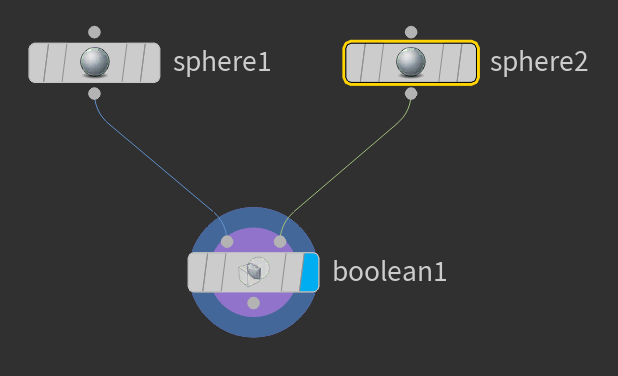
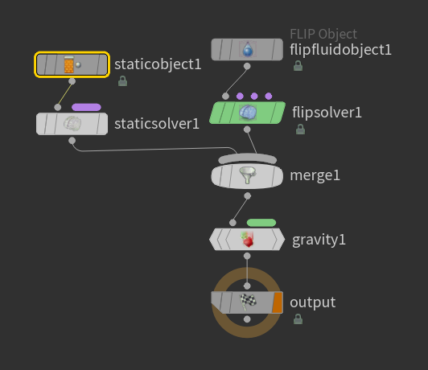

# Houdini Fluid Sphere

1. Add a sphere and call it `fluid`
2. Choose `Particle Fluids > FLIP Fluid from Object`
3. Add a second sphere and call it `fluid_container`

## `fluid_container`

1. Double-click into `fluid_container`, and increase the `sphere1` `Rows` and `Columns` until the sphere seems smooth.
2. Duplicate the sphere by option dragging it out
3. Change the radius of the second `sphere2` to `0.4 0.4 0.4`
4. Add a `Boolean` and subtract `sphere2` from `sphere1`

## `AutoDopNetwork`

1. Go to `obj/AutoDopNetwork`
2. Add a `Static Object` and set its `SOP Path` to `/obj/fluid_container`
3. Add a `Static Solver` and connect the output of `staticobject1` to its input
4. Connect the output of `staticsolver1` to the `merge1` input
5. Disconnect the output of `flipsolver1` to `merge1` and then re-connect it again, so the first input to `merge1` is from `staticsolver1` and the second is from `flipsolver1`

