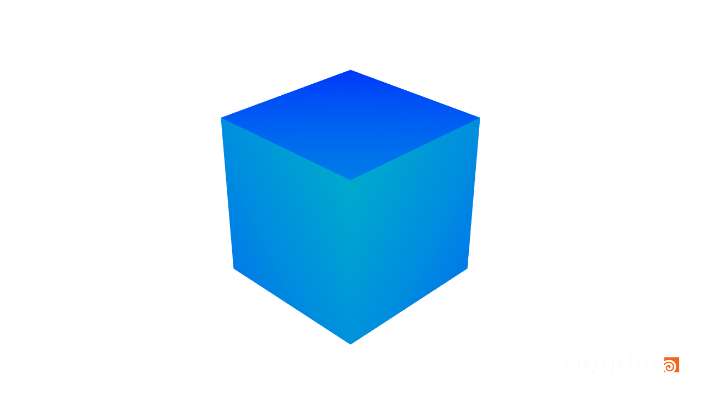
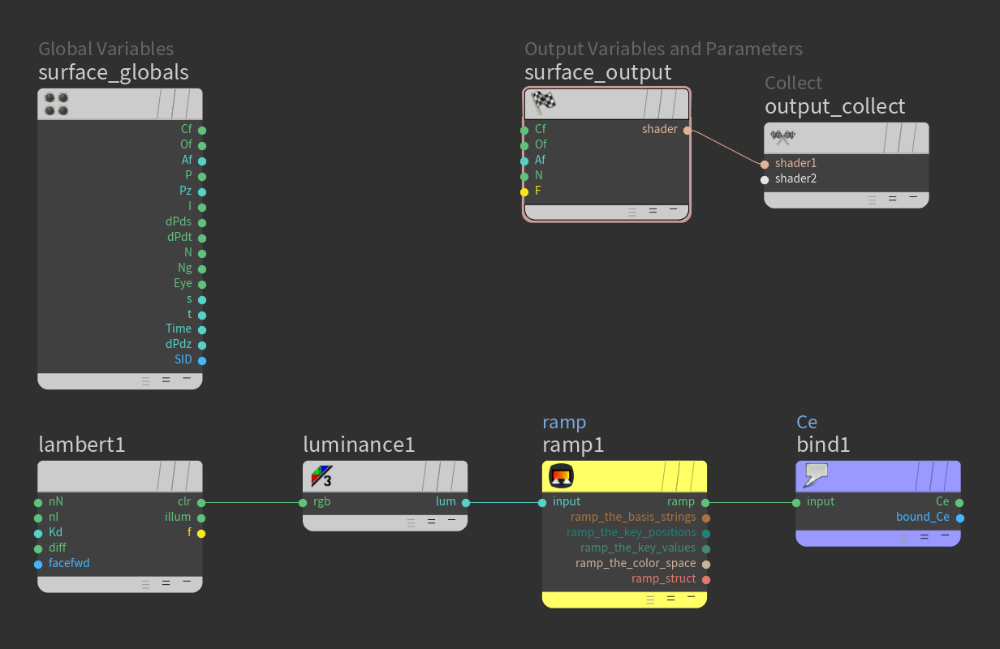

# Houdini Gradient Cube

1. Make a cube, by adding a "Box".

## Material

1. Switch to the `mat` network and add a `Material Builder`.
2. In `materialbuilder1`, delete the two displacement nodes, so only `surface_globals`, `surface_output`, and `output_collect` remain.
3. Add a `Bind Export`. Set `Name: Ce` (for "color emission"), and `Type: Vector (vector)`.
4. Add a `Lambert` and a `Luminance`, attach the `lambert1: clr` output to the `luminance1: rgb` input.
5. Add a `Ramp Parameter` and attach the `luminance1: lum` output to its `input` input. Attach its `ramp` output to the `bind1: input` input.

## Assigning the Material

1. Go to the `obj` network and select `box1`, under `render` properties, click the `Open floating operator chooser` icon and select `materialbuilder1`.

Note that this material will only show up in the `Render View`, and not the `Scene View`.

## Render Node

1. From the menu, choose `Render > Create Render Node > Mantra - PBR`.
2. Under `out` delete any render nodes besides the newly created `mantra1`. (there's a `mantra_ipr` by default that can be deleted.)