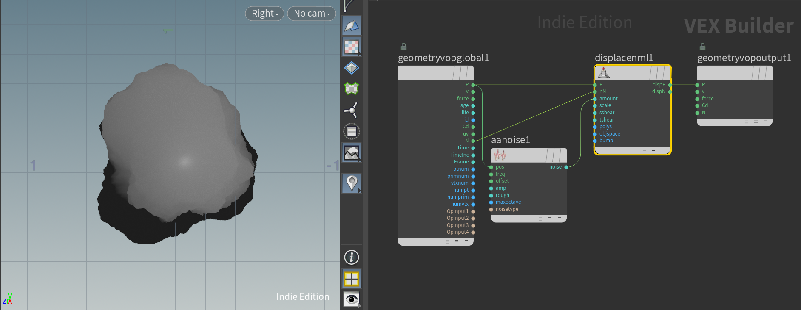

# Houdini Noise Displacement

## `/obj`

1. Add (`⇥` in the `Network Editor`) a `Sphere (Create)`
1. Double-click into the Sphere in the `Network Editor`, and under `sphere1` set `Primitive Type: Polygon` and `Frequency: 256`

## `/obj/sphere1`

1. Add a `Normal`, and set `normal1 > Group Type: Points`
2. Attach the output of `sphere1` to the input of `normal1`
3. Choose `normal1 > Display/Render` in the `Network Editor` (blue section)
4. (In the sidebar on the right of the viewport, there's a `Display normals` icon you can toggle to display the normals)
5. Add a `Point VOP`, and connect the output of `normal1` into the left most input of `pointvop1`
6. Choose `pointvop1 > Display/Render` in the `Network Editor` (blue section)
7. Double-click into `pointvop1`

## `/obj/sphere1/pointvop1`

1. Add a `Displace Along Normal`, and connect the `geometryvopglobal1 > P` output to the `displacenml1 > p` input, and the `geometryvopglobal1 > N` output into the `displacenml1 > nN` input
2. Connect the `displacenml1 > dispP` output to the `geometryvopoutput1 > P` input
3. (Now dragging the `displacenml1 > Displacement Amount` parameter should make the sphere larger, this is what we want to control via the noise)
4. Add a `Anti-Aliased Noise`, and connect the `geometryvopglobal1 > p` output to the `aanoise1 > pos` input, and connect the `aanoise1 > noise` output to the `displacenml1 > amount` input.

    

5. Under `aanoise1`, set `roughtness: 0` and `3D Frequency: 2 2 2`
6. To map the noise output values from being between `-0.5--0.5` to `-1--1`, add a `Fit Range`, and `fit1`, set `Source Min` and `Source Max` to `-.5` and `.5`.
