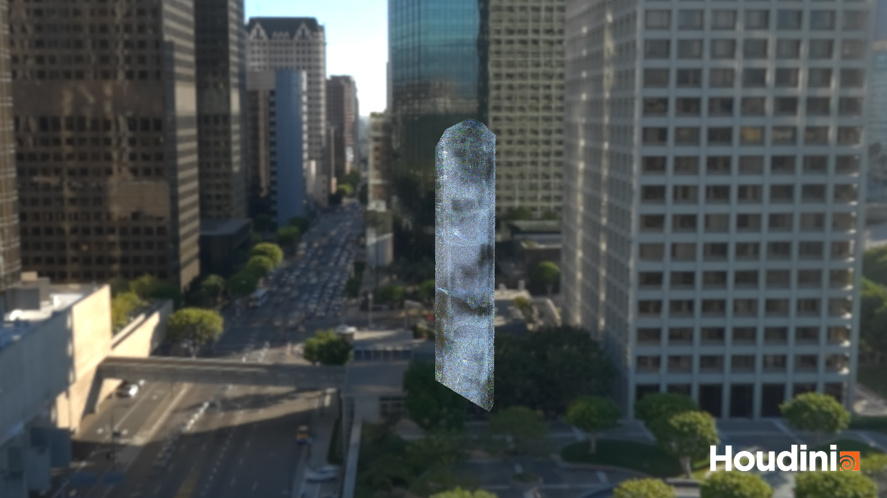
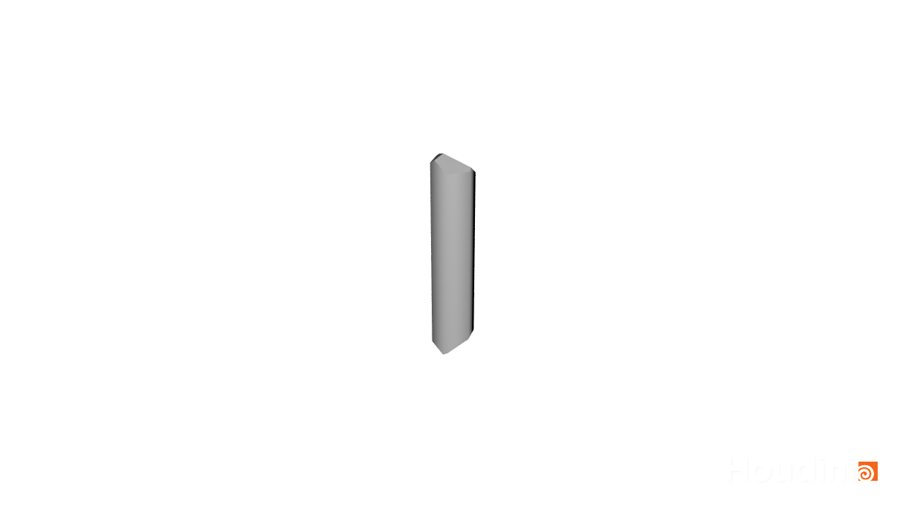
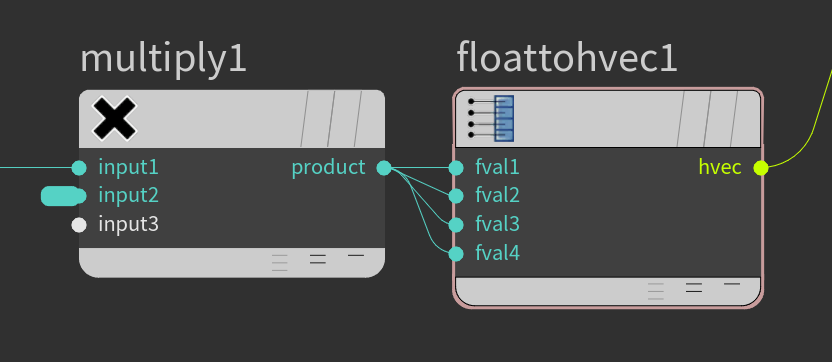

# Houdini Quartz Crystal

## 1. Basic Shape

1. Add a `Geometry` node and enter it.
2. Add a `Tube` node. Set: 
    - `Primitive Type: Polygon`
    - `Columns: 6`
    - `End Caps: On`
    - `Radius Scale: 0.1`
    - `Add Vertex Normals: On`
3. Add a `Platonic Solids`, set `Solid Type: Dodecahedron`
4. Add a `Normal`, and connect the output of `platonic1` to the input of `normal1`.
5. Add a `Transform` and connect the output of `normal1` to the input of `transform1`.
6. In `transform1`, set:
    - `Uniform Scale: 0.5` 
    - `Translate: 0 0.0033 0.065`
    - `Rotate: 44.7 23.7 -22.11`
7. Add a `Boolean` and set `Operation: Intersect`. Connect the output of `tube1` to the left input of `boolean1` and the output of `transform1` to the right input of `boolean1`.

## 2. Dents

### 3. Creating Dent Shapes

1. Add a `Convert Line`, connect the output of `boolean1` to its input.
2. Add a `Scatter`, connect the output of `convertline1` to its input. Set `Force Total Count: 120`, `Relax Iterations: Off`.
3. Add a `Sphere`. Set `Primitive Type: Polygon`, `Uniform Scale: 0.007`.
4. Add a `Copy to Points`, connect the output of `sphere1` to the left input and the output of `scatter1` to the right input.
5. To introduce entropy, add an `Attribute Randomize` and set `Attribute Name: pscale`, `Dimensions: 1`. Connect the output of `scatter1` to the input of `attribrandomize1`, and the output of `attribrandomize1` to the input of `copytopoints1`.
6. To add imperfections to the spheres by distorting them, add a `Mountain`, connect the output of `copytopoints1` to the input of `mountain1`. Set `Height: 0.03` and `Element Size: 0.01`.

### 4. Connecting Dents

1. Add a `Boolean`. Connect the output of `boolean1` to the left input of `boolean2`, and the output of `mountain1` to the right input of `boolean2`. Make sure that `Operation: Subtract` to subtract the second input from the first input. Set `Collapse Tiny Seam-Adjacent Edges: Off`.

## 3. Fractures

Create the fractures through intersection geometry.

1. Add a `Bound` node, connect the output of `boolean1` to its input. Set `Lower Padding: 0.1 0.1 0.1` and `Upper Padding: 0.1 0.1 0.1`.
2. Add a `VDB from Polygons`. connect the output from `bound1` to its left input. Set:
    - `Voxel Size: 0.004`.
    - `Fog VDB: On`
    - `Fill Interior: On`
    - `Exterior Band Voxels: 1`

### 1. Noise

1. Add a `Volume VOP` and connect the output of `vdbfrompolygons1` to its leftmost input.
2. Go into the `volumevop1` and add a `Unified Noise`. Connect the `P` output of `volumevopglobal1` to the `pos` input of `unifiednoise1`, and connect the `noise` output of `unifiednoise1` to the `density` input of `volumevopoutput1`.
3. Middle-mouse-button click and select `Promote Parameter` for the following inputs of the `unifiednoise1`:
    - `fractal`
    - `oct`
    - `lac`
    - `rough`
    - `basis`
    - `freq`
    - `offset`
4. Go up a level to `geo1`, set the `volumevop1 > Fractal Type: Terrian`
5. Add a `Convert VDB`, and connect the output of `volumevop1` to its the left most input. Set `Convert To: Polygons` and `Isovalue: 0.47`.
6. Add a `Boolean` and connect the output of `convertvdb1` to its right input, and the output of `boolean2` to its left input. Set `Operation: Shatter`, `Correct Tiny Seam-Adjacent Edges: Off`.

### 2. Increasing Entropy

To increase realism, drive the noise frequency by its position within the volume, so that there's more fractures at the top and the bottom and less in the middle.

1. Go into `volumevop1`. Add a `Vector to Float` and connect the `volumevopglobal1 > BB` output to its `vec` input.
2. Add a `Multiply`, connect the `vectofloat1 > fval2` output (the *second* output) to its `input1`.
3. Add a `floattohvec1`, connect the `multiply1 > product` output to all four of its inputs.

    

4. Connect the `floattohvec1 > hvec` output to the `unifiednoise1 > freq` input.
5. Go up a level to `geo1`, set `volumevop1 > Input Number 2: 40` (this is the second input on the `multiply` node.)

### 3. Noise Tweaks

1. Select the `convertvdb1` and set `Isovalue: 0.281`.
2. Select the `volumevop1` and set `Noise Type: Worley/Cellular | F1`.

## 4. Inclusions

1. Add a `VDB from Polygons`, and connect the output of `boolean1` to its left input. Set: 
    - `Fog VDB: On`
    - `Voxel Size: 0.003`
    - `Exterior Band Voxels: 1`
    - `Fill Interior: On`
2. Add a `Volume VOP` and connect the output of `vdbfrompolygon2` to its left input.
3. Go into the `volumevop2` and add a `Unified Noise`. Connect the existing `volumevopglobal1: P` output of to its `pos` input. Connect its `noise` output to the existing `volumevopoutput1: density` input.
4. Middle-mouse-button click and select `Promote Parameter` for the same list of inputs as previously on the new `unifiednoise1` (with the addition of `period`):
    - `fractal`
    - `oct`
    - `lac`
    - `rough`
    - `basis`
    - `freq`
    - `offset`
    - `period`
5. Go up a level to `geo1`, select `volumevop2` and set:    
    - `Frequency: 20 20 20 10`
    - `Fractal Type: Terrain`
    - `Roughness: 1`
    - `Noise Value: Value Noise | Alligator`
6. Add a `Convert VDB`, and set `Convert To: Polygons`. Connect the output of `volumevop2` to its leftmost input. Set `isovalue: 0.65`.
7. Add a `Normal` and connect the output of `convertvdb2` to its input.
8. Go up a level to `geo1`, add another `Normal` and connect the output of `boolean3` to its input.

## 5. Materials

1. Add a `Material` and connect the output of `normal2` to its input.
2. Add a `Material` and connect the output of `normal3` to its input.
3. 
4. Add a `Merge` and connect the output of `material1` to its input, then connect the output of `material2` to its input.
5. Add an `Output` and connect the output of `merge1` to its input.

### 1. Material Network

1. Add a `Material Network` and double-click into it.
2. Add a `Classic Shader`, set `Surface > Diffuse > Enable Diffuse: Off`, and under `Surface > Refract`, set:
    - `Enable Refractions: On`
    - `Refraction Model: GGX`
    - `Transmission > Dispersion: 0.1`

    Set `Surface > Subsurface > Scatter Distance: 0.0.25`, under `Displacement`, set:

    - `General > True Displacement: Off`
    - `Noise > Enable Noise Displacement: On`
    - `Noise > Frequency: 10 300 10`
    - `Offset > 7 11 -3`
    - `Amplitude: .001`

## 6. Lighting

1. With `classicshader1` still selected, set `Surface > Subsurface > Enabled Subsurface Scattering: Off`.
2. Go to the `obj` level, add an `Environment Light` and `Camera` by `⌃`-clicking on their corresponding icons in the toolbar.
3. Select `envlight1`, and click the icon to the right of `Environment Map` to load an HDRI, set `Render Light Geometry: On`.

## 7. Rendering

1. Click the `Render View` tab, and go to the `out` level in the node editor.
2. There should already be an existing `mantra_ipr` node at the `out` level. (If there's not try zooming out or clicking `Render`.)
3. Select the `mantra_ipr` and set `Rendering > Render Engine > Physically Based Rendering`.
4. Then click `Render` to do a test render. (There are some normal errors, and the material hasn't been attached.)

## 8. Fixing Normal Errors

1. Rename `geo1` to `crystal`.
2. Select `normal3` and set `Cusp Angle: 3`
3. Select `material2`, and click the `Open floating operator chooser` icon to the right of `Material` and choose `obj > crystal > matnet1 > classicshader1`.

## 9. Clean Up

1. Go to `out`, select `mantra_ipr`, and under `Limits` set `Reflect Limit: 16` and `Refract Limit: 16`.
2. Go to `obj > crystal > matnet1` and under `classicshader1 > Settings`, toggle off `Shade Both Sides As Front`, and set `Inside IOR: 1.458`.
3. Add a second `Classic Shader`, toggle off `Enable Diffuse`, under `Refract`, toggle on `Enable Refractions` and set `Refraction Model: GGX`. Set `Settings > Inside IOR: 1`. Rename `crystalshader2` to `air`.
4. Go to the `crystal` level, and select `material1`, and click the `Open floating operator chooser` icon to the right of `Material` and choose `obj > crystal > matnet1 > air`.

## 10. Adding Cloudiness

1. Go back to `obj > crystal > matnet1` and rename `classicshader1` to `quartz`.
2. Select `quartz` and toggle on `Surface > Enable Subsurface Scattering`.
3. Go to `out`, select `mantra_ipr` and, under `Limits`, set `SSS Limit: 8` ("Subsurface Scattering"), and `Diffuse Limit: 2`. Under `Sampling`, set `SSS Quality: 2`.
4. Go back to `obj > crystal > matnet1`, select `quartz` and set `Surface > Subsurface > Subsurface Intensity: 10`.
5. Go back to `obj > crystal > matnet1` and add a `Unified Noise`.
6. Toggle open the `quartz > Surface` inputs, attach the `unifiednoise1 > Noise` output into the `quartz > sss_int` input.
7. Add a `Global Variables` and connect the `global1 > P` (position) output to the `unifiednoise1 > pos` input.
8. Select the `unifiednoise1` and set `Fractal > Fractal Type: Standard (fBm)`, `Frequency: 7 7 7 7`, under `Output Correction`, set: 
    - Toggle on and set `Gain: 0.9 0.5 0.5`
    - Toggle on `Output Range (Clamped)`
    - `New Maximum: 7 1 1`