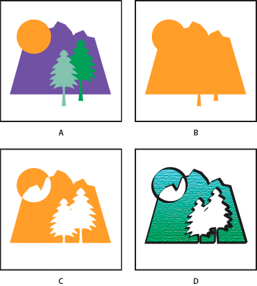

# Illustrator Glossary

## Compound Shape

Art consisting of two or more objects.

- **A:** Original objects
- **B:** Compound shape created
- **C:** Individual shape modes applied to each component
- **D:** Style applied to entire compound shape 
