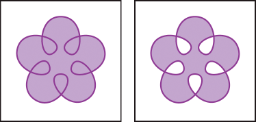

# Illustrator Glossary

## Compound Shape

Art consisting of two or more objects.

- **A:** Original objects
- **B:** Compound shape created
- **C:** Individual shape modes applied to each component
- **D:** Style applied to entire compound shape 

## Compound Path

Two or more paths that are painted so that holes appear where paths overlap.

Self-intersecting path with Use Non‑Zero Winding Fill Rule (left) compared with Use Even‑Odd Fill Rule (right).
