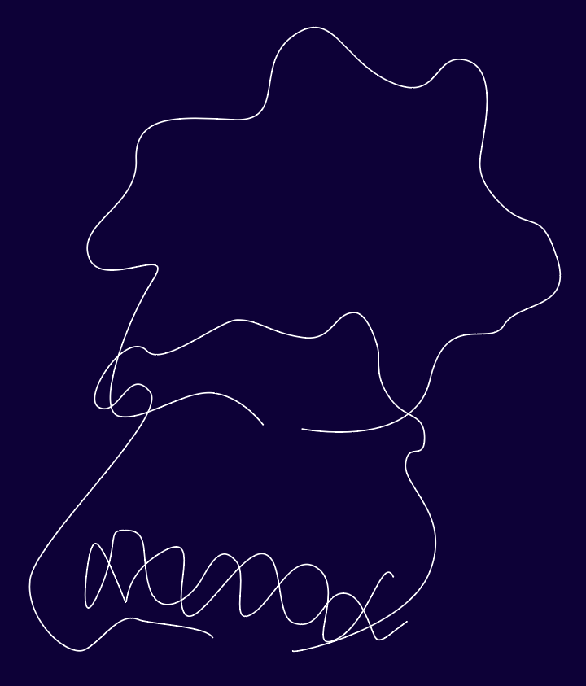

# Illustrator Gradient Art

## 1. Curved Paths With Spine

1. Select the Pen tool (`P`), turn off the fill color and set the stroke color to black
2. Draw a wavy line
3. Draw a second wavy line down below, a bit smaller horizontally and with some intricate details like loops

    

4. Create a blend between the two curves: Select both curves using the selection tool (`V`), then switch to the Blend tool (`W`), and click on the farthest left starting point of the top curve, then the farthest left starting point of the bottom curve (the Blend tool cursor should have a "+"). This creates a blending object between the two curves.
5. To increase the number of steps, double click the blending tool icon, change the spacing to "Specified Steps", set the steps to `106".
6. To add some more variation: Use the Pen tool (`P`) to draw another curve to the left that looks a bit like a spiral. Select all the curves (`⌘A`), then select "Object > Blend > Replace Spine".
7. You can edit the spine curve by double-clicking and using the Direct Selection tool (`A`)
8. Select all (`⌘A`) and increase the "Specified Steps" to `181` by double-clicking the Blend tool.

### Create a Background

1. Add a rectangle behind the design that's the same size as the artboard, and set its color to dark blue.

### Tweak Design

1. With the design selected, go to "Window > Stroke" and set the "Weight: `0.5`", and set the stroke color to white.
2. The design looks better if the spline has even spacing, tweak the spine curve to even out the spacing. An easy way to do this is to switch to the "Anchor Point Tool" (`⇧C`)` and adjust the curve's point.

### Gradient

1. Add a gradient to two non-spine curves (top and bottom curves). To add the gradient, select a curve in the Layers panel (click the circle to the right), then select "Window > Gradient", click the stroke once to select it, then click the gradient color well once to apply it.
2. Use a different color for the top curve and the curve.

## 2. Wavy Shape

1. Make a dark background and draw a wavy shape with the Pen tool with the two end points ending up close to each other, but not closing the shape.
2. Make a second wavy curve that intersects back on itself.

    

3. Make select both shapes, and select the Blend tool. Click the farthest left endpoint of the top curve, and the top endpoint of the bottom curve.
4. With the Selection tool (`V`), select all `⌘A`, then select "Object > Expand", and accept the default settings.
5. Right-click the design an select "Ungroup". This will separate out each curve.
6. Edit the new (middle) curve expand it some and remove any sharp corners.

    

7. Select all (`V` for the Selection tool, then `⌘A`), click in this order:
    1. Top curve left point
    2. Middle curve left point
    3. Bottom curve right point
8. Change the steps to `75` (double-click the Blend tool icon, select "Spacing: `Specified Steps` `75`")
9. Change the Stroke size to `0.25` (under "Properties")
10. Adjust the curves using the Direct Selection tool and clicking single points then moving them.
11. Set the "Spacing: `Specified Steps` `182`" (`V` for Selection Tool, then `⌘A`, then double-click the Blend Tool).
12. Select the top curve and add a gradient to the stroke (`⌘F9`, then click the stroke, then click the gradient icon). Choose colors for the gradient stops. Set the gradient rotation to `-90`.
13. Select the middle curve, and apply the same gradient color.
14. Select the bottom curve and apply the same gradient, but change both stops to the bottom color.
15. Select each curve and reduce the stroke thickness to `0.1` (`⌘F10` to show the stroke panel)
