# Photoshop 3D Properties

Photoshop uses Adobe Standard Material properties.

## Surface

### Base Color

The surface tint of the geometry. It affects both the bounced light and the light that refracts through the geometry. You can set it to a color value or input an RGB image.

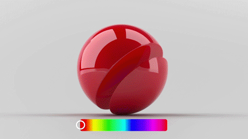

### Glow

The intensity of light that is emitted from the surface. It can be set to zero or a positive value or can input a black and white image. When using an image, black areas reflect light while white areas emit light. The color of the light emitted is controlled by Base Color, glow only specifies the intensity.

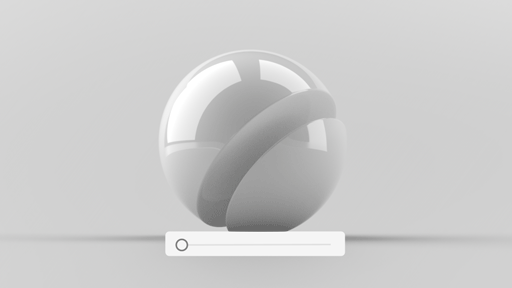

### Opacity

The visibility of the surface geometry. It can be set to a value between 0 and 1, or can input a black and white image. When using an image, black areas are transparent while white areas are opaque. Note that visibility is not refraction: when opacity is less than one, the transparent portion of light passes directly through the object and is not refracted at all. To enable refraction, set the Translucence property defined below.

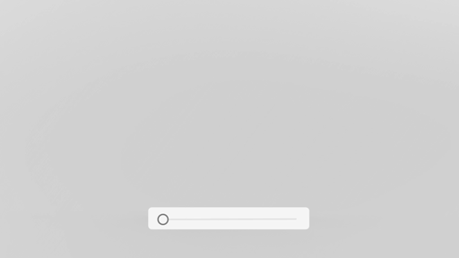

### Roughness

How shiny the surface geometry is. It can be set to a value between 0 and 1, or can input a black and white image. When using an image, black areas are polished and white areas are matte.

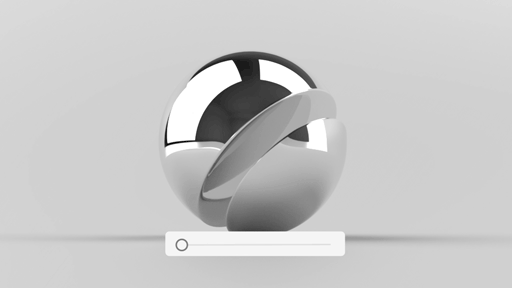

### Metallic

 The degree of metallic luster a surface has. It can be set to a value between 0 and 1, or can input a black and white image. When using an image, black areas will be non-metallic and white areas will be metallic. Metallic areas will tint reflections according to the Base Color, whereas non-metallic areas will not tint reflections.

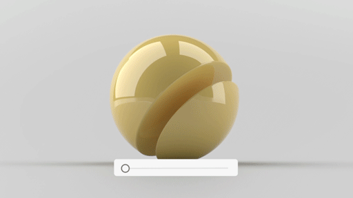

## Interior

### Translucence

The amount of light able to refract through the object. It works in conjunction with the other interior properties. It can be set to a value between 0 and 1, or can input a black and white image. When using an image, black areas are non-translucent and white areas are translucent.

### Refraction

The amount light bends as light passes through the object, and only has an effect when the material has some level of translucency. It can be set to a value between 1 and 3. The value is the same throughout the entire volume of the object. Therefore, an image input is not supported.

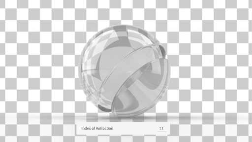

### Density

The clarity of the interior volume to be clear or foggy and only has an effect when the material has some level of translucency. It can be set to zero or any positive value. The value is the same throughout the entire volume of the object. Therefore, an image input is not supported.

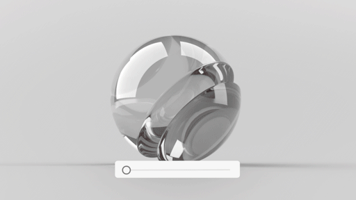

### Interior Color

The color of the interior volume fog and only has an effect when the material has some level of translucency and some level of density. It can be set to a color value. The value is the same throughout the entire volume of the object. Therefore, an image input is not supported.

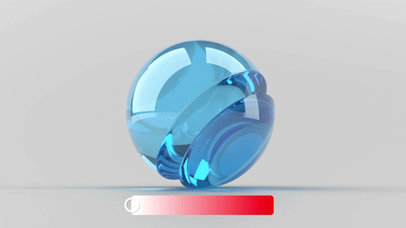

## Shape

### Height

Offset the surface shape based on an image. Bump maps are not currently supported as height is always a true displacement for more realistic effects. Height must be set using a black and white image input. When using an image, black areas are lowered and white areas are raised — a 50% gray value represents unchanged height.

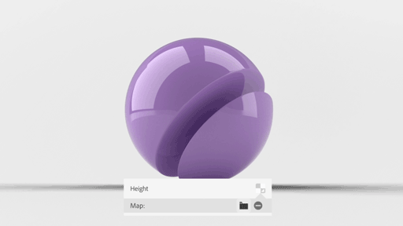

### Height Scale

The strength of the offset created by the image used in the height property. Height Scale is only available if an image is used in the height property and can be set to zero or a positive value. Setting the Height Scale to zero will eliminate any displacement on the surface.

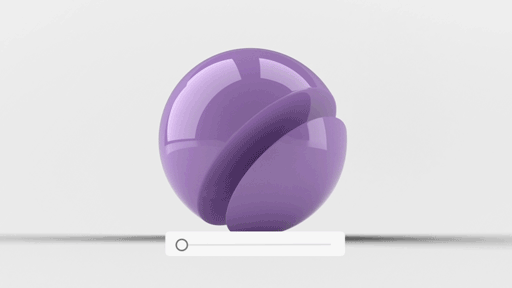

### Normal Map

Surface details without displacement. Normal maps work in conjunction with the height map, to change the angle of the surface geometry or to fake additional lighting information. The normal map must be set using a linear RGB image input.

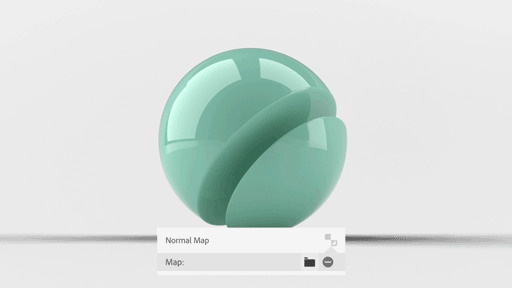