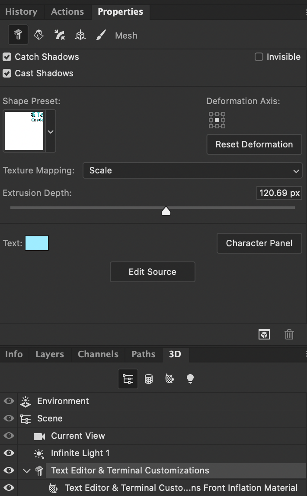

# Photoshop 3D

- `⇧⌥⌘R`: Render

## Changing the Source

If you've already created a 3D extrusion, and you want to edit the source layer: In the 3D panel, select the layer for the extrusion, then, in the properties panel, under the `Mesh` tab, choose `Edit Source`.

## Text

To edit 3D text, select the text in the 3D panel and then click `Edit Source`.

## Tips

- In 3D mode, the three icons in the lower right orbit, pan, and dolly (zoom).

## Rendering

Once you have acceptable quality, just hit the `⎋` key. The main thing keeping the render going will do is reduce the amount of noise.

## Views

You can take a view of your model and save it under the `Properties` panel with the `3D Camera` icon selected. Choose `Save…` from the `View:` drop-down menu. This allows you to rotate your model and view it from other angles while always being able to return to a saved view.

## Light

With `Environment` selected in the `3D` panel, and `IBL` turned on in the `Properties` panel, the sphere in the viewport can be dragged to change the direction of the lighting.

## Manipulator

The manipulator appears when a 3D object is selected.

- The manipulator has a arrow, curve, and square for each axis. The arrow moves, the curve rotates, and the square scales. The square in the center scales all axes simultaneously.
- You can scale the size of the manipulator itself by dragging the center square and holding `⇧`.

## Troubleshooting

Resolving `Could not complete` `because the path is too complex`.
