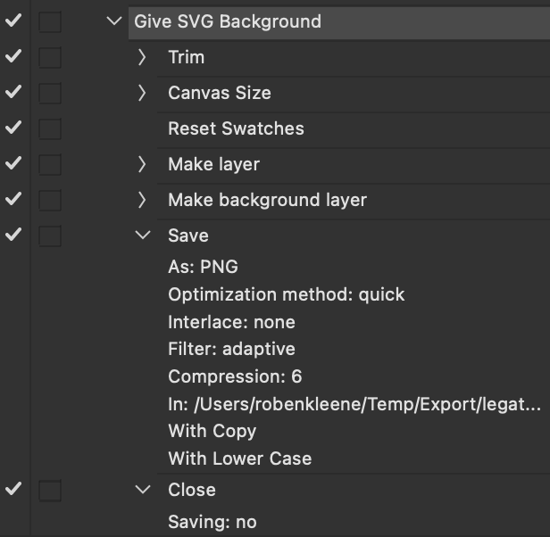
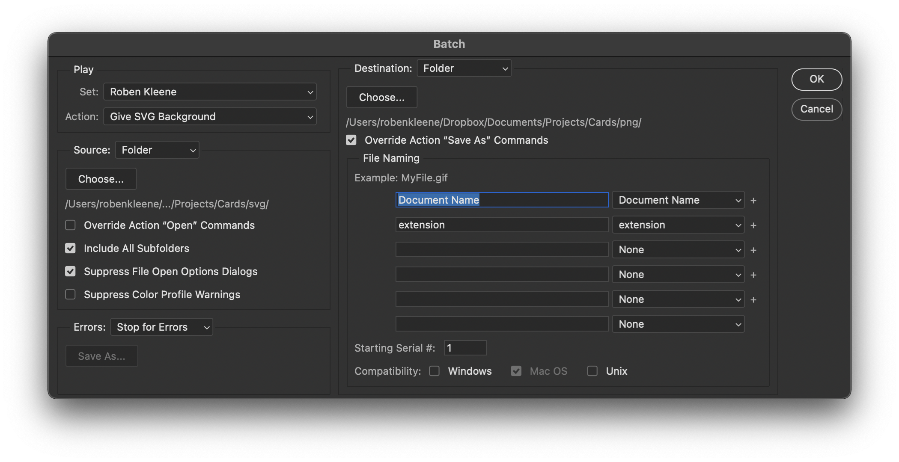

# Photoshop Actions Batch

To batch apply an `Action` to a folder full of images:

1. Record the action (note you don't need to have save and close steps)
2. Choose `File > Automate > Batch...`
3. Optionally choose `Destination: Save and Close`, in order to overwrite the existing files

## Save As

- The `Override Action "Save As" Commands` toggle under the `Batch` dialog is a bit confusing, what this does is take any existing recorded `Save` steps in the action and override just the filename in that save command.

## Example

An action setup to export as PNG:

Batch settings to run the above action:

