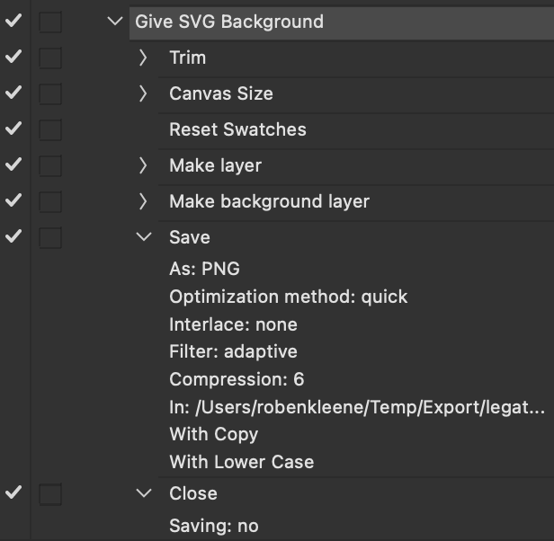

# Photoshop Actions

- To restore the default actions, select `Reset Actions` from the Actions panel menu. The default actions can be appended to the existing actions.

## Adding Padding

- Choose `Image > Canvas Size...` then toggle on `Relative`.

## Adding a White Background

1. Set your background color (`D` sets the default colors, which is white for the background)
2. Choose `Layer > New > Layer...`
3. Choose `Layer > New > Background from Layer...`

## Batch

- `File > Automate > Batch`
- The `Override Action "Save As" Commands` toggle under the `Batch` dialog is a bit confusing, what this does is take any existing recorded `Save` steps in the action and override just the filename in that save command.

An action setup to export as PNG:

Batch settings to run the above action:

