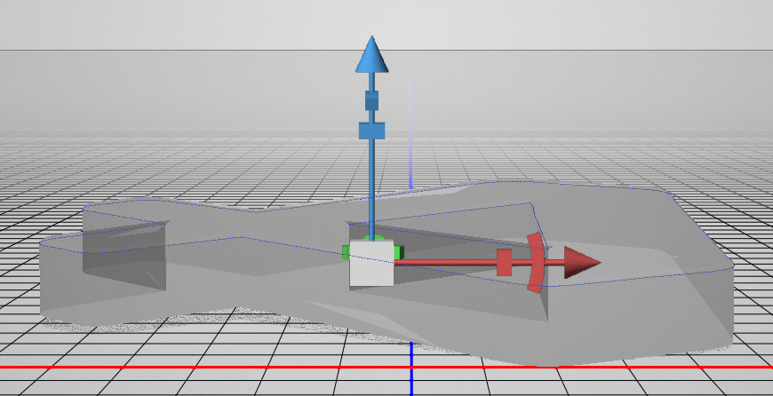

# Photoshop 3D Frosted Glass

## Setup

1. Create a new `1920x1080` file.

## Background

1. Rename the `Background` layer as `BG`
2. Choose a offwhite gray, and fill the layer with it
3. Add a `Gradient Overlay` with:
    - `Blend Mode: Multiply`
    - `Opacity: 20%`
    - White to Black
    - Toggle on `Reverse`
    - `Style: Radial`
    - `Angle: 60`
    - `Scale: 150`

### Removing Gradient Banding

1. Right-click the `Gradient Overlay` effect in the Layers panel and choose `Create Layer`.
2. Select the `BG Gradient Fill` layer and choose `Filter > Noise > Add Noise...`:
    - `Amount: 3`
    - `Distribution: Gaussian`
    - `Monochromatic: On`
  
## Add Logo

1. Drag the logo into the document and make it all white by adding a color overlay to blending options.
2. Choose `3D > New 3D Extrusion from Selected Layer`.
3. With the logo's layer selected in the `3D` panel, in the `Properties` panel, with the `Mesh` icon selected, set `Extrusion Depth: 100`.
4. Switch to `Cap` icon in the `Properties` panel. Set `Width: 5%`, set `Sides: Front and Back`.

## Logo Material

1. Select all five materials in the `3D` panel.
2. Set:
    - `Shine: 63%`
    - `Metallic: 15%`
    - `Roughness: 3%`
    - `Height: 2%`
    - `Opacity: 10%`
    - `Refraction: 1.6`

## Logo Position

1. Rotate the logo around the X-axis and move it down so that it's laying flat.

## Camera

1. In the `3D` panel select the camera by choosing `Current View`, and using the orbit, pan, and dolly icons in the lower left, choose a camera position that looks good, aiming down at the icon.
2. Save the view (`Properties > 3D Camera > View > Save...`).

## Light

1. In the `3D` panel, select `Infinite Light 1`, choose a nice angle for the light.
2. Select `Environment` in the `3D` panel and adjust the opacity of the shadows in the `Properties` panel.

## Frosted Glass

1. Select the `Front Inflation Material` and `Back Inflation Material`, then click the folder icon next to `Height` in the `Properties` panel and choose `New Texture...`. Save the default (two dialogs will pop up, click save in both).