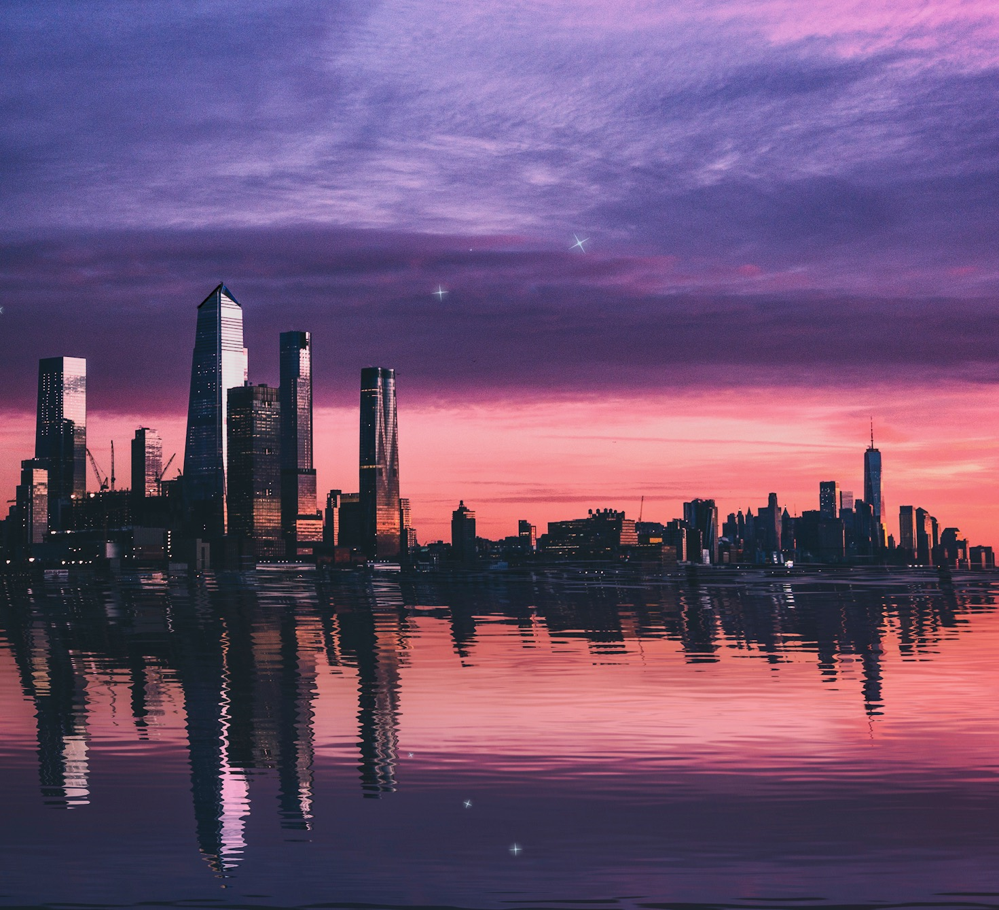

# Photoshop Reflections

To create a water reflection:

1. Select the part of the image to create the reflect from and copy and paste it to a new layer. (This should just be a rectangle that includes the sky, and ideally it should cover the entire bottom of the image).
2. Select "Edit > Transform > Flip Vertical"
3. Position the new reflection layer
4. Convert the reflection layer to a smart object (right-click the layer and select "Convert to Smart Object")
5. Select "Filter > Blur > Motion Blur..." and select "Angle" `90` and "Distance" `11`

## Creating the Displacement Map

1. Create a new Photoshop file that's roughly same width and twice as tall as the original image.
2. Fill the layer with black
3. Add a noise filter ("Filter > Noise > Add Noise..."), set the "Amount" to the maximum, "Uniform" and "Monochromatic".
4. Add a Gaussian blur filter ("Filter > Blur > Gaussian Blur..."), set the radius to `1.3`
5. Goto the "Channels" palette, select the `red` channel,  then click the eye next to another channel (to make all channels visible).
6. Add a emboss filter to the red channel ("Filter > Stylize > Emboss..."), set the "Angle" to `180`, the "Height" to `1`, and the "Amount" to the maximum.
7. Select the `green` channel and add an emboss filter to it to, with the Angle set to `90` and the other settings the same.
8. Switch back to the Layers palette, select "Edit > Transform > Perspective" and drag the bottom right corner to the right to create perspective. Drag it really far, like 90 degrees, the idea here is to add variation in the noise to make it look like ripples you'd see looking out over a body of water.
9. The last step will make the file size gigantic, so then select "Layer > Flatten Image" before saving.
10. Go to "File > Save As…" and save the displacement map as a `PSD` file
11. Close the displacement map file

## Applying the Displacement Map

1. In the original image file, select the reflection layer
2. Select "Filter > Distort > Displace...", set "Horizontal Scale" to `10` and "Vertical Scale" to `40`, turn on "Stretch to Fit" and "Repeat Edge Pixels", click "Ok" and then select the displacement map file from the file chooser.
3. Change the amount of ripple distortion, "Displace" filter's "Vertical Scale" (increase for more distortion)