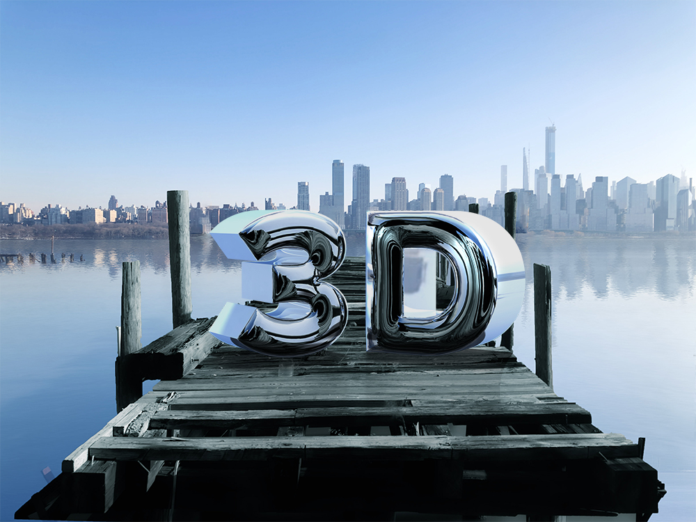

# Photoshop 3D Chrome Text

## Setup

1. Start with an existing document with good ground perspective for placing 3D text on.
2. Use the Type Tool to add the letters "3D" and choose a size and font.
3. Click the "3D" icon in the Type Tool's toolbar to make the text 3D.

## Perspective

1. Hide the 3D model by toggling off the eye icon for the `3D` layer in the 3D panel.
2. Find the vanishing point, and then drag a horizontal guideline and position it at the vanishing point, this is the horizon line.
3. In the 3D panel (you can always get the 3D panel back by double-clicking the 3D layer), select the camera ("Current View"). This will show a grid of converging lines, and a horizon line. Using the "Orbit the 3D camera" button in the lower left, adjust the horizon line for the 3D camera to match our horizon line guideline.
4. To fine tune the grid placement, with the Current View (Camera icon) selected in the 3D, open the Properties panel then click the Coordinates icon to manually enter precise values.
5. Show the 3D model again by toggling on the eye icon for the `3D` layer in the 3D panel.

## Model

1. You can move the model by selecting the `3D` layer in the 3D panel, and then using the arrows that appear on the model in the view port to move it. To quickly place the model on the ground, toggle `Properties > Coordinates > Move To Ground`.
2. When you have the model positioned nicely, save the view as `Final View` by choosing `Save...` from the `View:` pop-up menu under `Properties` panel with the `3D Camera` icon selected.
3. Click the `3D` text in the `3D` panel, then under the `Properties` panel, choose `Inflate` as the `Shape Preset`.
4. Choose a value for `Extrusion Depth` in the `3D` `Properties` panel. (This is a good opportunity to use the orbit controls in the lower-left of the viewport to get a top view of the model, to change the `Extrusion Depth`, then select the `Current Camera` from the `3D` panel and choose `View` `Final View` from the `Properties` panel to get the view back to normal.)

## Material

1. In the `3D` panel, click the disclosure triangle next to `3D`, this will reveal the materials (`3D Front Inflation Material`, etc...). Select all five materials, then in the `Properties` panel, set `Base Color: 0.30 0.30 0.30`.
2. In the `Layers` panel, select the background image, select all (`⌘A`) and copy it (`⌘C`). Double-click the `3D` layer to go back to the `3D` panel, and select `Environment`. Make sure `IBL` ("Image-Based Light") is turned on and click the image to the right of it and select `New Texture...`, and accept the default settings.
3. The new `IBL` texture is all white. Edit it by clicking the image to the right of it again, and selecting `Edit Texture...`. Paste in the image from the clipboard, then use `Image > Trim...` and `Image > Reveal all` to make the canvas match the image. Save and close the texture.
4. To increase the reflectiveness of the material, select all of the materials in the `3D` panel, and in the `Properties` panel, increase `Metallic` to `100%`. If the reflections still aren't showing up, also increase the brightness of the `Base Color` until they're visible. The reflects are more visible in the rendered image, so you might want to increase the brightness of the `Base Color` again before rendering. (If changing the `Base Color` isn't sticking, make sure in the color picker that `Intensity` is set to `0`.)
5. To adjust the angle of the `IBL` reflection, use the `Move Tool` (`V`) with `Environment` selected in the `3D` panel, then drag the sphere in the center of the viewport.
6. Select all of the material rows in the `3D` panel, and set the `Roughness` to `0` in the `Properties` panel. To make reflective surfaces in Photoshop, use a high value for `Metallic` and a low value for `Roughness`.

## Rendering

1. Drag a selection around the 3D letters with the Marquee Tool (`M`), then click the `Render` icon in the upper right of the `3D` panel.
2. After the preview starts to show, tweak the settings, especially the brightness. You can cancel the render with `⎋`.

## Lighting

1. Select the `Infinite Light 1` in the 3D scene and drag it until the light matches the lighting of the scene.
2. You can change the shape and size of the shadows by adjusting the `Color` and `Shadow` sliders in the `Properties` panel when `Infinite Light 1` is selected.
3. You can change the color of the shadows by selecting `Environment` and changing the `Shadows` color in the `Properties` panel. A good strategy is to base the shadow color off of a dark color in your scene so that it matches better.
4. You can also add reflections to the ground plane in the `Environment` properties. Change the `Reflections` `Opacity` and `Roughness`. (You can select just the reflections with the marquee tool and click render to quickly iterate.)

## Split

1. With the `3D` layer selected in the `3D` panel, choose `3D > Split Extrusion` to divide the 3D text into two layers.
2. For some reason the `D` might be moved somewhere, perhaps even offscreen, to move it back, select the `D` in the `3D` panel, and then move it back to the correct spot by using the manipulator (you might also have to zoom out to see the whole manipulate). These properties can also be edit manually under `Properties > Coordinates`, you should probably click the `Move To Ground` button there too.
3. Rotate the letters so they're facing each other a bit, and adjust their size and positioning to taste.

## Finishing Touches

1. Render the entire scene (this may take awhile, like an hour)
2. In the `Layers` panel, `⌥`-click the 3D layer to hide all the others. Select all (`⌘A`), `Edit > Copy Merged` (`⇧⌘C`), and `Edit > Paste Special > Paste in Place` (`⇧⌘V`).
3. Add a `Layer Mask` to the 3D layer and using the brush tool with black as the foreground color to clean up the reflections and shadows (paint with the brush tool to remove).
4. To adjust the brightness to match the scene, add a new `Levels...` adjustment layer. In the `Properties` panel for the adjustment layer, click the `The adjustment layer clips to the layer` icon at the bottom to only effect the layer below (the 3D text layer).
5. Use the middle slider in the `Levels 1` adjustment layer to adjust the contrast. To make this easier, temporarily add a `Black & White` adjustment layer to make it easier to make the lilghting match.

## Highlights

1. Add a new layer (`⇧⌘N`), clip the layer to the layer below (`⌥⌘G`, the layer below should be `Levels 1`).
2. Use the brush tool to paint somewhere you want a highlight to appear, choose an area that will make the lighting match better. The brush should have a low hardness.
3. Enter the Blending Options (right-click to the right of the layer in the Layers panel), set the `Blend Mode: Color Dodge` and uncheck `Transparency Shapes Layer`. Adjust the `Fill Opacity` to taste.