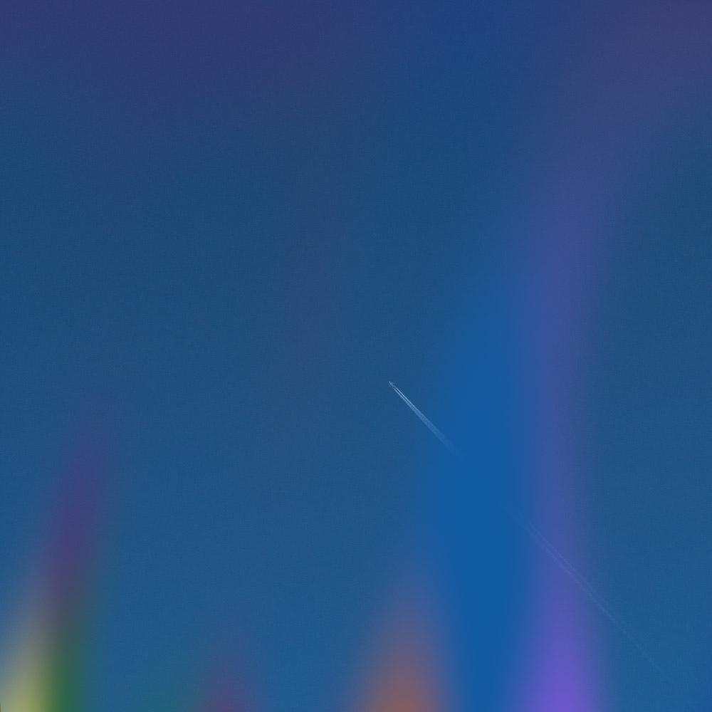
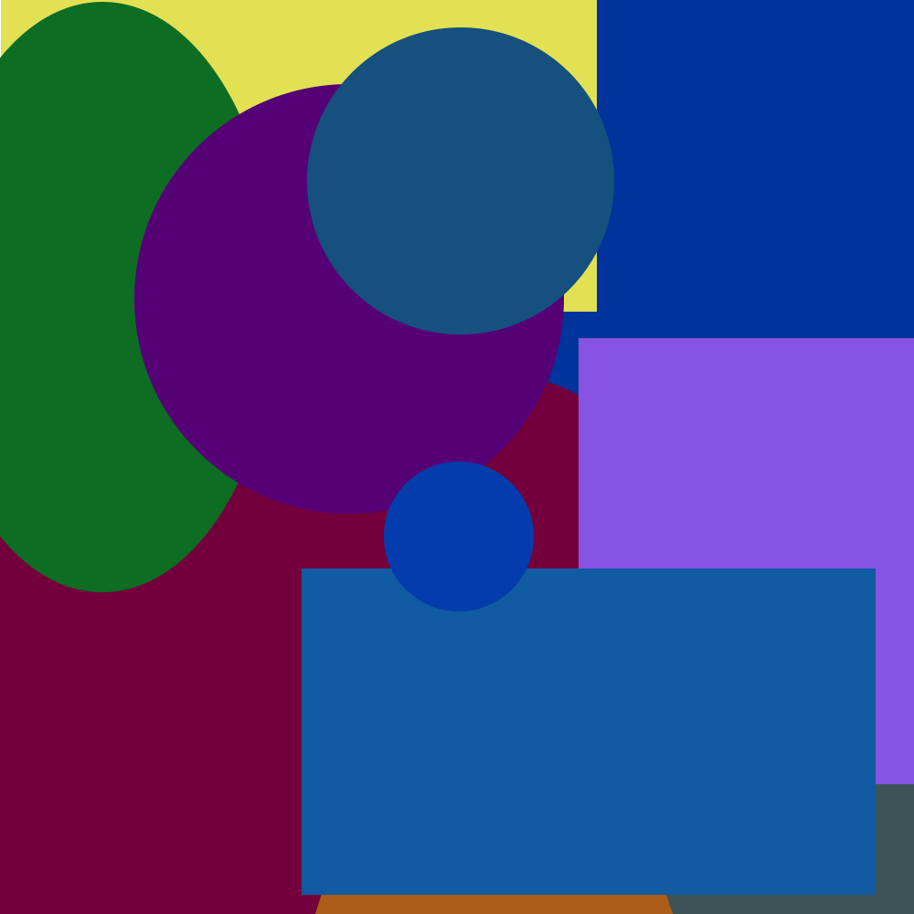
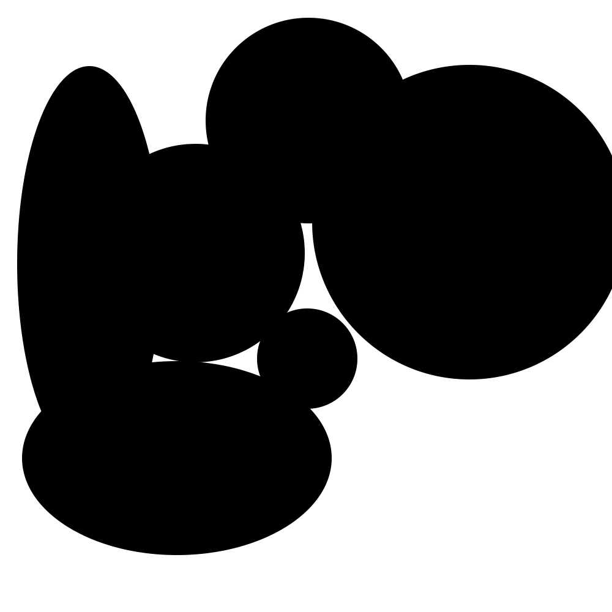
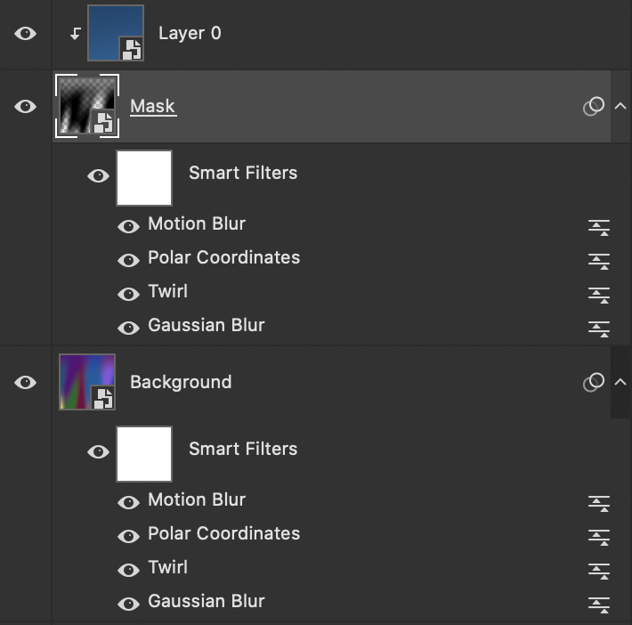

# Photoshop Blur Shapes

To create an interesting colored layer effect.

## Blurred Layer

1. Make some colored boxes or circles
2. Convert to a Smart Object
3. Apply a Gaussian Blur
4. Apply a Twirl
5. Apply a Polar Coordinates
6. Apply a Motion Blur
7. Make a Hue/Saturation Adjustment Layer

## Mask

1. Make another layer of boxes and circles but colored all black
2. Copy the same layer effects from the blurred layer to this layer.
3. Make this layer a mask

