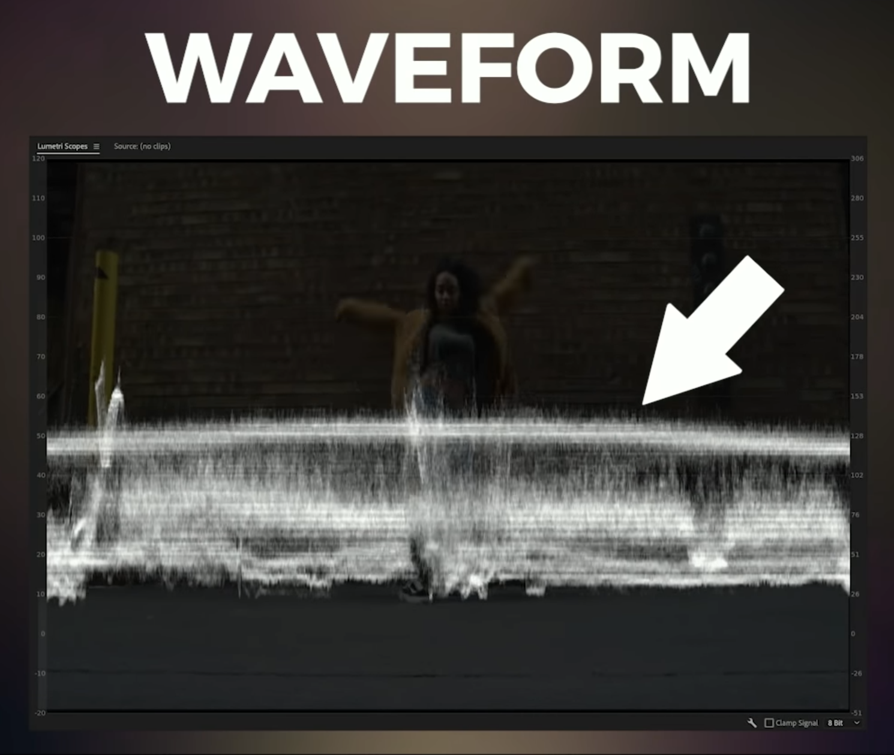
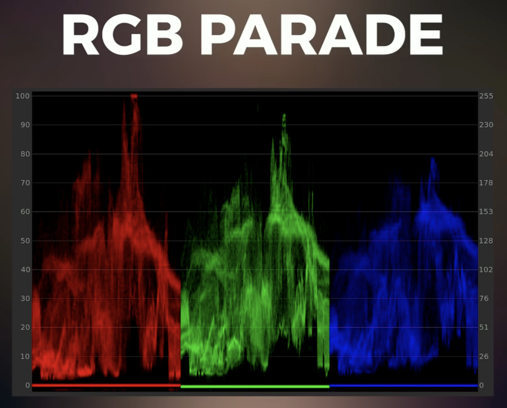
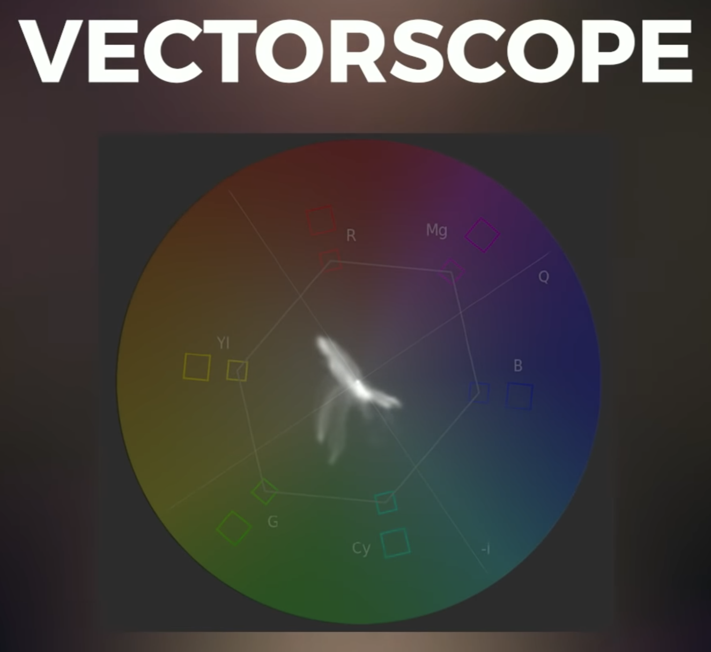

# Premiere Pro Color

- Switch to the `Color` tab
- To get other scopes, like a vectorscope, right-click the scope and toggle them on.

## Workflow

1. Correct exposure
2. Fix white balance
3. Adjust saturation

## Controls

In the `Lumetri Color` panel, the `Basic Correction` section has options like `Exposure`, `Contrast`, etc...

## Scopes

### Waveform

Corrects for exposure. The trace corresponds to the content of the video.

### RGB Parade

Corrects for white balance issues. It's similar to the waveform but broken out into the individual color channels. It good for spotting imbalances if the images is too cool or too warm, that will look like one channel elevated above the others.

### Vectorscope

Corresponds with the color wheel (overlaid for reference in this image). It shows which colors are in an image and their saturation, the further the trace extends from the center of the scope, the more saturated or vivid the colors are.

