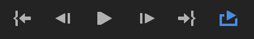

# Premiere Pro Timeline

- `←` / `→`: Move the playhead backward / forward by one frame
- `⇧←` / `⇧→`: Move the playhead backward / forward by five frames
- `HOME` or / `END` : Move to the beginning / end of the sequence (if a clip is selected, this will go to the beginning or end of the selected clip, unselect with `⎋`)
- `⇧HOME` or `↑` / `⇧END` or `↓`: Move the playhead to the beginning / end of the clip
- `↩`: Play from the beginning
- `␣`: Play/pause

## Secondary

- `J` / `L`: Move backward or forward
- `K`: Pause
- `'` or `⇧⌦`: Extract (ripple delete marked)

### Delete

It's called "ripple" because the effect of the edit "ripples" to affect other clips.

- `Q`: Ripple delete before playhead
- `W`: Ripple delete after playhead
- `'` or `⇧⌦`: Extract (ripple delete marked)

### In & Out Point

- `I`: Mark in point 
- `O`: Mark out point
- `⌥I`: Clear in point 
- `⌥O`: Clear out point 
- `⌥X`: Clear in and out point 

Using a combination of `j` / `l`, `←` / `→`, and `i`, `o`, `,` to make quick fine-grained edits.

## Editing

- `⌘K`: Split clip
- `S`: Toggle Snap

## Paste

- The basic system for paste is to unselect all tracks (selected tracks are the ones where, the identifiers, e.g., `V1`, `V2`, etc... are highlighted) with `⇧-click`, then select just the track to paste to by clicking it.
- If more than one track are selected then pasting will go to the lowest track.

## Snap

- `s`: Toggle snap

## Looping

- In the viewport, there's a plus icon in the lower-right, you can use that to add the loop button.

