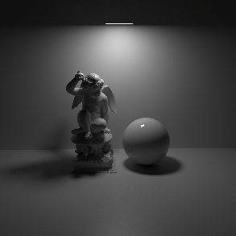
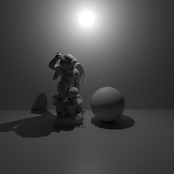
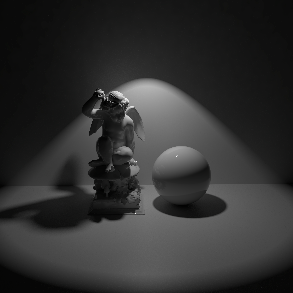
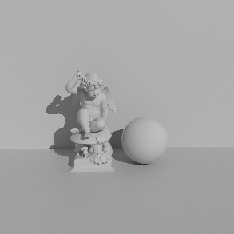
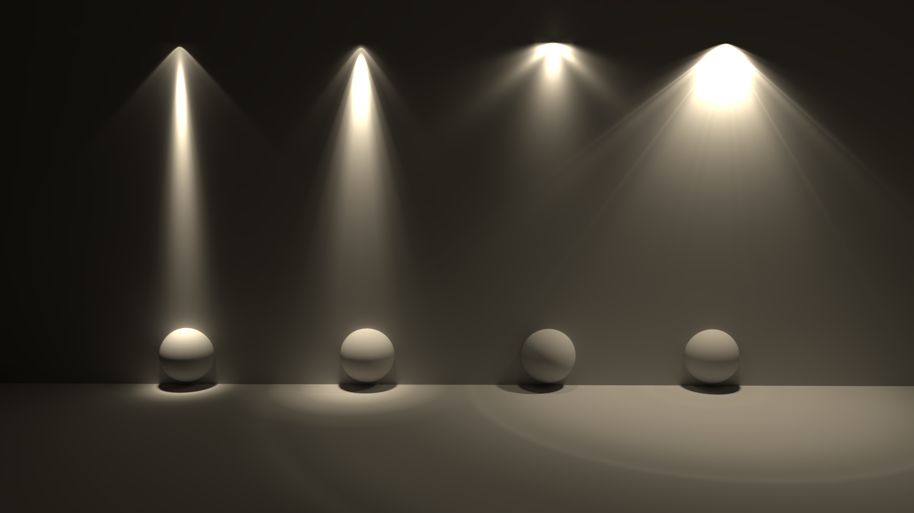
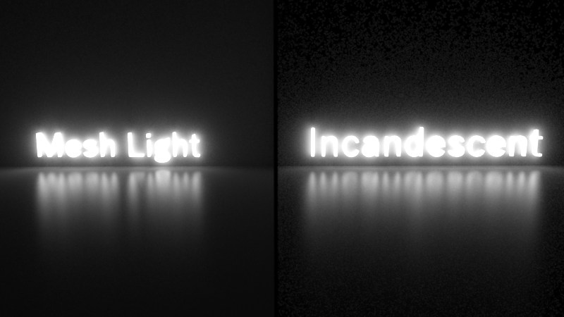

# Redshift Lights

- **Point:** A point light. Simulates a 'bare bulb' light which emits light in all directions from an infinitesimally small point in space.
- **Spot:** A spot light. Emits light in a cone-shape.
- **Infinite:** Simulates a light source which is infinitely far away from the scene. An infinite light has no position, only a direction. Therefore all light rays emitted are parallel and have no decay.
- **Area:** A light which has a real physical size and shape.
- **Dome:** Simulates light emitting from a large sphere that always surrounds the entire scene. You can think of this as a sky that illuminates your objects and that can also be mapped with an image, for example. The dome light can thus also be used like a Cinema 4D Sky object.
- **Photometric IES:** Allows to load an IES Profile files to control the amount and direction of emitted light.
- **Portal:** A special type of light source that can optimize the calculation of global illumination. Often used in window frames for interior renderings to optimize the rendering of indirect light coming through the windows.
- **Physical Sun:** Similar to the Infinite light, but specially designed to mimic sunlight, including a color change depending on the angle of incidence of this light source.

## Light

Has a `Light Type`.

### Type Area

### Type Point

### Type Spot

### Type Infinite

## IES Light

> IES stands for Illuminating Engineering Society. The IES data format describes the distribution of light from a point source. Most major manufacturers of lights provide IES profiles which can be downloaded for free.

## Portal Light

> A portal light is a rectangular area light used to assist in indoor Global Illumination. It acts a virtual window, casting direct lighting into a room from the environment outside.

## Physical Sun

> The Redshift Physical Sun directional light is a physically accurate representation of sunlight based on the PRG Clear Sky model from the paper "A Fitted Radiance and Attenuation Model for Realistic Atmospheres" which improves upon the Hosek-Wilkie sky model. The Physical Sun is generally used in combination with the Physical Sky environment shader but it can also be used by itself.

## Mesh Light

> Area lights in Redshift can have a predefined shape (such as rectangle, disc, cylinder or sphere) or can have their shape defined by a user-specified mesh, in which case the light is referred to as a "mesh light".

## Dome Light

> The Redshift Dome Light is an infinite, texture-mapped area light. Using HDR images you can achieve high-quality lighting results that would otherwise require several lights. Since a single dome light can reproduce the lighting of several distant lights, it can help with performance too. Since an HDR image can originate from a real-world environment, the dome light is an important tool to match the lighting of cg elements with live-action elements. Ideally, High Dynamic Range (HDR) textures in OpenEXR format should be used because they can capture a wide range of intensities.

## Physical Light

> The Redshift Physical Light is an all-purpose light which can be used to model point, spot and directional lights as well as area lights of various shapes.
